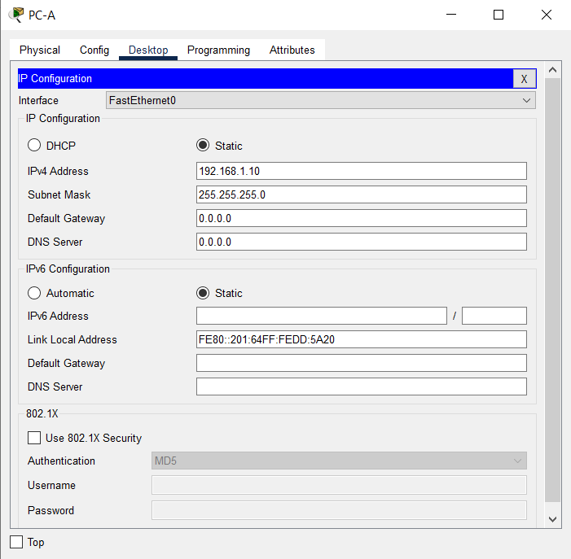

# Базовая Настройка коммутатора.  
### Топология.  
  
### Таблица адресации.  
| Устройство | Интерфейс | IP-адрес/префикс |
| --- | --- | --- |
| S1 | VLAN 1 | 192.168.1.2/24 |
|  |  |  |
|  |  |  |
| PC-A | NIC | 192.168.1.10/24 |
### Задачи.  
#### Часть 1. Проверка конфигурации коммутатора по умолчанию.  
enable  
show running-config  
  
  
#### Часть 2. Создание сети и настройка основных параметров устройства.  
##### Настройте базовые параметры коммутатора.  
Switch>enable  
Switch#configure terminal  
Switch(config)#line console 0  
Switch(config-line)#password cisco  
Switch(config-line)#login  
Switch(config-line)#end  
Switch#  
Switch#configure terminal  
Switch(config)#enable secret class  
Switch(config)#end  
Switch#  
Switch#configure terminal  
Switch(config)#line vty 0 15  
Switch(config-line)#password cisco  
Switch(config-line)#login  
Switch(config-line)#end  
Switch#  
Switch#configure terminal  
Switch(config)#service password-encryption   
Switch(config)#end  
Switch#  
Switch#configure terminal  
Switch(config)#banner motd #  
Unauthorized access is strictly prohibited. #  
Switch(config)#hostname S1  
S1(config)#no ip domain-lookup  
S1(config)#end  
S1#  
S1#copy running-config startup-config  
S1#configure terminal  
S1(config)#interface vlan 1  
S1(config-if)#ip address 192.168.1.2 255.255.255.0  
S1(config-if)#no shutdown  
S1(config-if)#end  
S1#  
S1#copy running-config startup-config  
  
  
##### Настройте IP-адрес для ПК.  
  
#### Часть 3. Проверка сетевых подключений.  
##### Отобразите конфигурацию устройства.  
  
  
##### Протестируйте сквозное соединение, отправив эхо-запрос.  
  
##### Протестируйте возможности удаленного управления с помощью Telnet.  
  
