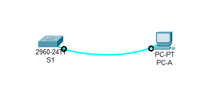

Схема лабораторнрго стенда, выполненная в CPT.

Схема подключения по консольному кабелю.

Почему нужно использовать консольное подключение для первоначальной настройки коммутатора? Почему нельзя подключиться к коммутатору через Telnet или SSH?  
Ответ. Консольное подключение мы используем потому, что у нас еще не настроены интерфейсы для подключения. Для подключения по Telnet или SSH нам необходимо предварительно настроить ip-адрес на интерфейс, через который мы будем подключаться.  
Проверяем файл конфигурации по умолчанию:  
enable  
show running-config  
  
  
Сколько интерфейсов FastEthernet имеется на коммутаторе 2960?  
24  
Сколько интерфейсов Gigabit Ethernet имеется на коммутаторе 2960?  
2  
Каков диапазон значений, отображаемых в vty-линиях?  
Диапазон: 0-4 и 5-15  

Проверяем файл загрузочной конфигурации (startup configuration), который содержится в энергонезависимом ОЗУ (NVRAM):  
show startup-config  
  
Почему появляется это сообщение?  
Не знаю.  
Изучите характеристики SVI для VLAN 1.  
  
Назначен ли IP-адрес сети VLAN 1?  
Нет  
Какой MAC-адрес имеет SVI?  
0001.4388.b890  
Данный интерфейс включен?  
Нет, выключен.  
Изучите IP-свойства интерфейса SVI сети VLAN 1.  
Какие выходные данные вы видите?  
Никаких.  

Схема подключения по кабелю Ethernet.  

⦁	Подсоедините кабель Ethernet компьютера PC-A к порту 6 на коммутаторе и изучите IP-свойства интерфейса SVI сети VLAN 1. Дождитесь согласования параметров скорости и дуплекса между коммутатором и ПК.
Примечание. При использовании Netlab включите интерфейс F0/6 на коммутаторе S1.
Вопрос:
Какие выходные данные вы видите?
⦁	Изучите сведения о версии ОС Cisco IOS на коммутаторе.
Вопросы:
Под управлением какой версии ОС Cisco IOS работает коммутатор?
Как называется файл образа системы?
Какой базовый MAC-адрес назначен коммутатору?
⦁	Изучите свойства по умолчанию интерфейса FastEthernet, который используется компьютером PC-A.
Switch# show interface f0/6 
Вопрос:
Интерфейс включен или выключен?
Что нужно сделать, чтобы включить интерфейс?
Какой MAC-адрес у интерфейса?
Какие настройки скорости и дуплекса заданы в интерфейсе?
⦁	Изучите параметры сети VLAN по умолчанию на коммутаторе.
Какое имя присвоено сети VLAN 1 по умолчанию?
Какие порты расположены в сети VLAN 1?
Активна ли сеть VLAN 1?
К какому типу сетей VLAN принадлежит VLAN по умолчанию?
⦁	Изучите флеш-память.
Выполните одну из следующих команд, чтобы изучить содержимое флеш-каталога.
Switch# show flash 
Switch# dir flash: 
В конце имени файла указано расширение, например .bin. Каталоги не имеют расширения файла.
Вопрос:
Какое имя присвоено образу Cisco IOS?
