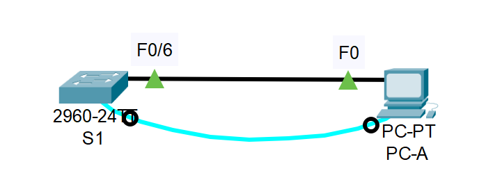

### Часть 1. Проверка конфигурации коммутатора по умолчанию.  

#### Схема лабораторнрго стенда, выполненная в CPT.

#### Схема подключения по консольному кабелю.

**Почему нужно использовать консольное подключение для первоначальной настройки коммутатора? Почему нельзя подключиться к коммутатору через Telnet или SSH?**  
Ответ. Консольное подключение мы используем потому, что у нас еще не настроены интерфейсы для подключения. Для подключения по Telnet или SSH нам необходимо предварительно настроить линии виртуального терминала VTY, через который мы будем подключаться.  
**Проверяем файл конфигурации по умолчанию:**  
enable  
show running-config  
  
  
**Сколько интерфейсов FastEthernet имеется на коммутаторе 2960?**  
24  
**Сколько интерфейсов Gigabit Ethernet имеется на коммутаторе 2960?**  
2  
**Каков диапазон значений, отображаемых в vty-линиях?**  
Диапазон: 0-4 и 5-15  

**Проверяем файл загрузочной конфигурации (startup configuration), который содержится в энергонезависимом ОЗУ (NVRAM):**  
show startup-config  
  
**Почему появляется это сообщение?**  
Не знаю.  
##### Изучите характеристики SVI для VLAN 1.  
  
**Назначен ли IP-адрес сети VLAN 1?**  
Нет  
**Какой MAC-адрес имеет SVI?**  
0001.4388.b890  
**Данный интерфейс включен?**  
Нет, выключен.  
##### Изучите IP-свойства интерфейса SVI сети VLAN 1.  
**Какие выходные данные вы видите?**  
Никаких.  

#### Схема подключения по кабелю Ethernet.  
  
**Подсоедините кабель Ethernet компьютера PC-A к порту 6 на коммутаторе и изучите IP-свойства интерфейса SVI сети VLAN 1. Дождитесь согласования параметров скорости и дуплекса между коммутатором и ПК.**  
**Какие выходные данные вы видите?**  

##### Изучите сведения о версии ОС Cisco IOS на коммутаторе.  
**Под управлением какой версии ОС Cisco IOS работает коммутатор?**  
version 15.0  
**Как называется файл образа системы?**  
2960-lanbasek9-mz.150-2.SE4.bin  
**Какой базовый MAC-адрес назначен коммутатору?**  

##### Изучите свойства по умолчанию интерфейса FastEthernet, который используется компьютером PC-A.  
Switch# show interface f0/6  
  
**Интерфейс включен или выключен?**  
Включен.  
**Что нужно сделать, чтобы включить интерфейс?**  
Он включается автоматически при подключении кабеля Ethernet.  
**Какой MAC-адрес у интерфейса?**  
0000.0c98.0906  
**Какие настройки скорости и дуплекса заданы в интерфейсе?**  
Full-duplex  
100Mb/s  
##### Изучите параметры сети VLAN по умолчанию на коммутаторе.  
**Какое имя присвоено сети VLAN 1 по умолчанию?**  

**Какие порты расположены в сети VLAN 1?**  

**Активна ли сеть VLAN 1?**  

**К какому типу сетей VLAN принадлежит VLAN по умолчанию?**  

##### Изучите флеш-память.  
Выполните одну из следующих команд, чтобы изучить содержимое флеш-каталога.  
Switch# show flash   
Switch# dir flash:   
  
В конце имени файла указано расширение, например .bin. Каталоги не имеют расширения файла.  
Вопрос:  
**Какое имя присвоено образу Cisco IOS?**  

### Часть 2. Создание сети и настройка основных параметров устройства.  
#### Настройка базовых параметров коммутатора.  
no ip domain-lookup  
hostname S1  
service password-encryption  
enable secret class  
banner motd #  
Unauthorized access is strictly prohibited. #  
  
**Назначьте IP-адрес интерфейсу SVI на коммутаторе. Благодаря этому вы получите возможность удаленного управления коммутатором.**  

**Доступ через порт консоли также следует ограничить  с помощью пароля. Используйте cisco в качестве пароля для входа в консоль в этом задании. Конфигурация по умолчанию разрешает все консольные подключения без пароля. Чтобы консольные сообщения не прерывали выполнение команд, используйте параметр logging synchronous.**  
S1(config)# line con 0  
S1(config-line)# logging synchronous   

#### Настройка IP-адреса на компьютере PC-A.
  
