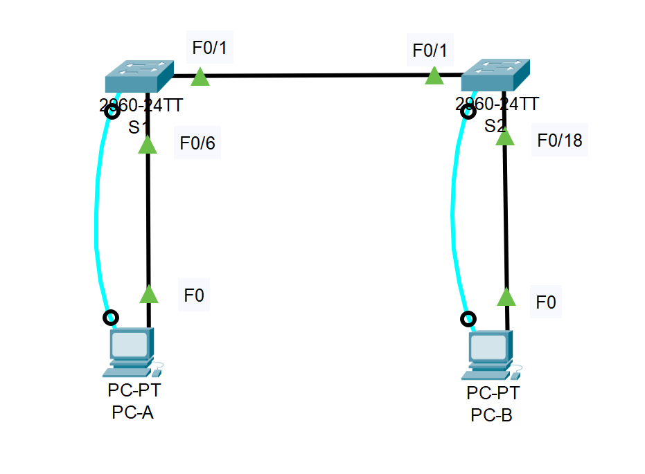
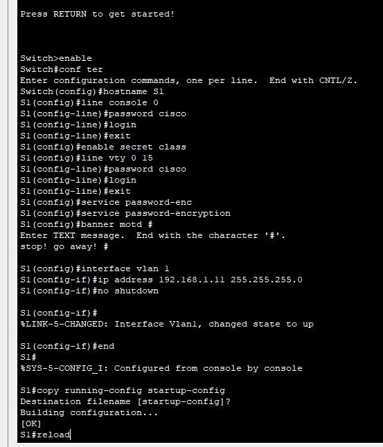
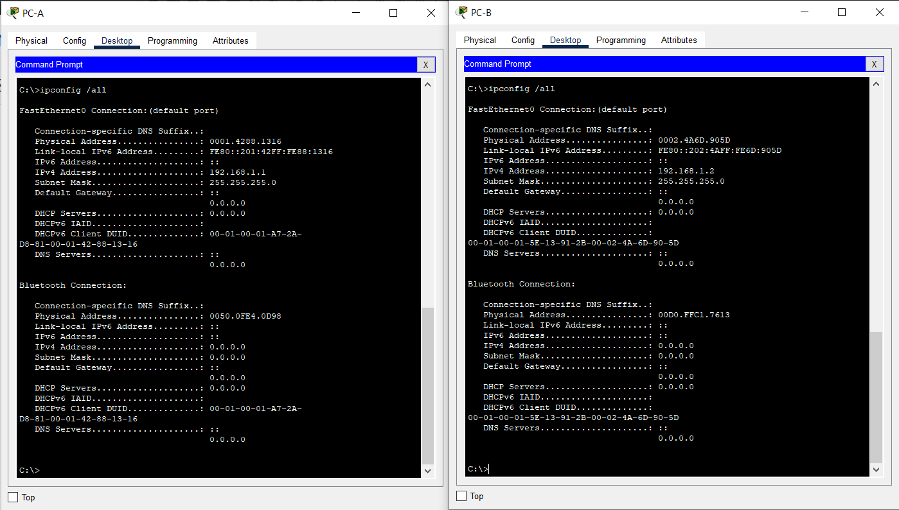

# MAC-адреса сетевых устройств
## Топология  
  
## Таблица адресации  
Таблица адресации приведена ниже:  
|Устройство|Интерфейс|IP-адрес|Маска подсети|
|:--------:|:-------:|:------:|:-----------:|
|S1|VLAN 1|192.168.1.11|255.255.255.0|
|S2|VLAN 1|192.168.1.12|255.255.255.0|
|PC-A|NIC|192.168.1.1|255.255.255.0|
|PC-B|NIC|192.168.1.2|255.255.255.0|

## Цели  
### Часть 1. Создание и настройка сети  
#### Подключите сеть в соответствии с топологией.  
#### Настройте узлы ПК.  
#### Выполните инициализацию и перезагрузку коммутаторов.  
#### Настройте базовые параметры каждого коммутатора.  
**Настройте имена устройств в соответствии с топологией.**  
**Настройте IP-адреса, как указано в таблице адресации.**  
**Назначьте cisco в качестве паролей консоли и VTY.**  
**Назначьте class в качестве пароля доступа к привилегированному режиму EXEC.**  
Ниже приведен пример настройки коммутатора S1:  
  
Настройки всех сетевых устройств приведены [здесь](Configs/).  
### Часть 2. Изучение таблицы МАС-адресов коммутатора  
#### Запишите МАС-адреса сетевых устройств.  
**Откройте командную строку на PC-A и PC-B и введите команду *ipconfig /all.***  
  
Назовите физические адреса адаптера Ethernet.  
**MAC-адрес компьютера PC-A:**  
0001.4288.1316  
**MAC-адрес компьютера PC-B:**  
0002.4A6D.905D  
**Подключитесь к коммутаторам S1 и S2 через консоль и введите команду *show interface F0/1* на каждом коммутаторе.**  
Назовите адреса оборудования во второй строке выходных данных команды (или зашитый адрес — bia).  
**МАС-адрес коммутатора S1 Fast Ethernet 0/1:**  

**МАС-адрес коммутатора S2 Fast Ethernet 0/1:**  
#### Просмотрите таблицу МАС-адресов коммутатора.  
Подключитесь к коммутатору S2 через консоль и просмотрите таблицу МАС-адресов до и после тестирования сетевой связи с помощью эхо-запросов.  
**Подключитесь к коммутатору S2 через консоль и войдите в привилегированный режим EXEC.**  
Откройте окно конфигурации
**В привилегированном режиме EXEC введите команду show mac address-table и нажмите клавишу ввода.**  
S2# show mac address-table  
_Записаны ли в таблице МАС-адресов какие-либо МАС-адреса?_  

_Какие МАС-адреса записаны в таблице? С какими портами коммутатора они сопоставлены и каким устройствам принадлежат?_  

Игнорируйте МАС-адреса, сопоставленные с центральным процессором.  
_Если вы не записали МАС-адреса сетевых устройств в шаге 1, как можно определить, каким устройствам принадлежат МАС-адреса, используя только выходные данные команды *show mac address-table*?_  

_Работает ли это решение в любой ситуации?_  

#### Очистите таблицу МАС-адресов коммутатора S2 и снова отобразите таблицу МАС-адресов.  
**В привилегированном режиме EXEC введите команду *clear mac address-table dynamic* и нажмите клавишу Enter.**  
S2# clear mac address-table dynamic  
**Снова быстро введите команду *show mac address-table*.**  
_Указаны ли в таблице МАС-адресов адреса для VLAN 1?_  

_Указаны ли другие МАС-адреса?_  

Через 10 секунд введите команду *show mac address-table* и нажмите клавишу ввода.  
_Появились ли в таблице МАС-адресов новые адреса?_  

#### С компьютера PC-B отправьте эхо-запросы устройствам в сети и просмотрите таблицу МАС-адресов коммутатора.  
**На компьютере PC-B откройте командную строку и еще раз введите команду *arp -a*.**  

_Не считая адресов многоадресной и широковещательной рассылки, сколько пар IP- и МАС-адресов устройств было получено через протокол ARP?_  

**Из командной строки PC-B отправьте эхо-запросы на компьютер PC-A, а также коммутаторы S1 и S2.**  
_От всех ли устройств получены ответы?_  
Если нет, проверьте кабели и IP-конфигурации.  
Закройте командную строку.
**Подключившись через консоль к коммутатору S2, введите команду *show mac address-table*. Откройте окно конфигурации.**  
_Добавил ли коммутатор в таблицу МАС-адресов дополнительные МАС-адреса?_  

_Если да, то какие адреса и устройства?_  

**На компьютере PC-B откройте командную строку и еще раз введите команду *arp -a*.**  

**Появились ли в ARP-кэше компьютера PC-B дополнительные записи для всех сетевых устройств, которым были отправлены эхо-запросы?**  

### Вопрос для повторения  
В сетях Ethernet данные передаются на устройства по соответствующим МАС-адресам. Для этого коммутаторы и компьютеры динамически создают ARP-кэш и таблицы МАС-адресов. Если компьютеров в сети немного, эта процедура выглядит достаточно простой.  
_Какие сложности могут возникнуть в крупных сетях?_  
