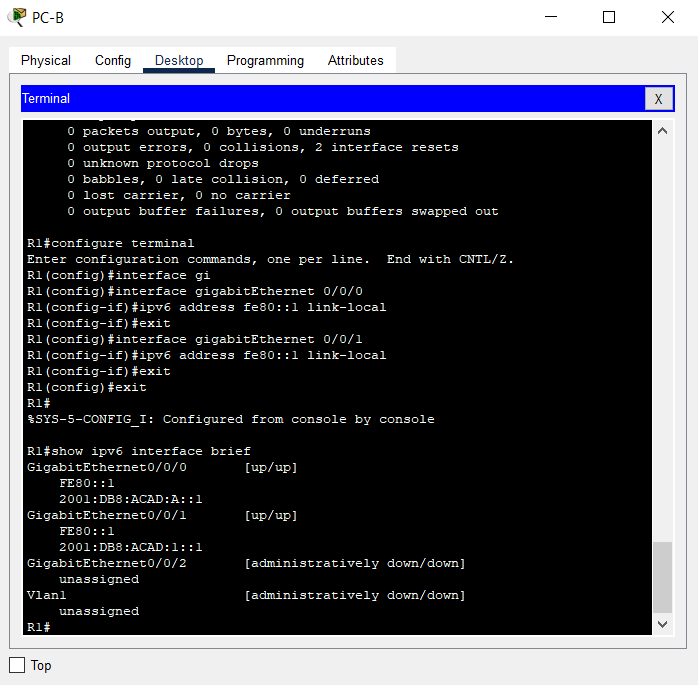

# Настройка IPv6-адресов на сетевых устройствах
### Топология

### Таблица адресации
|Устройство|Интерфейс|IPv6-адрес|Длина префикса|Шлюз по умолчанию|
|:---:|:---:|:---:|:---:|:---:|
| R1 | G0/0/0 | 2001 : db8 : acad : a : : 1 | 64 | - |
| R1 | G0/0/1 | 2001 : db8 : acad : 1 : : 1 | 64 | - |
| S1 | VLAN 1 | 2001 : db8 : acad : 1 : : b | 64 | - |
| PC-A | NIC | 2001 : db8 : acad : 1 : : 3 | 64 | fe80 : : 1 |
| PC-B | NIC | 2001 : db8 : acad : a : : 3 | 64 | fe80 : : 1 |

### Задачи
#### Часть 1. Настройка топологии и конфигурация основных параметров маршрутизатора и коммутатора
#### Часть 2. Ручная настройка IPv6-адресов
#### Часть 3. Проверка сквозного соединения
### Инструкции
### Часть 1. Настройка топологии и конфигурация основных параметров маршрутизатора и коммутатора
После подключения сети, инициализации и перезагрузки маршрутизатора и коммутатора выполните следующие действия:
#### Шаг 1. Настройте маршрутизатор.
Назначьте имя хоста и настройте основные параметры устройства.  
Базовая настройка маршрутизатора описана [здесь](Configs/R1).  
#### Шаг 2. Настройте коммутатор.
Назначьте имя хоста и настройте основные параметры устройства.  
Базовая настройка коммутатора описана [здесь](Configs/S1).  
Настройка PC-A и PC-B показана [здесь](Configs/)  
### Часть 2. Ручная настройка IPv6-адресов
#### Шаг 1. Назначьте IPv6-адреса интерфейсам Ethernet на R1.
a.	Назначьте глобальные индивидуальные IPv6-адреса, указанные в таблице адресации обоим интерфейсам Ethernet на R1.  
Настройка IPv6 адресов на интерфейсы маршрутизатора R1 приведена ниже:  
  
Откройте окно конфигурации  
b.	Введите команду show ipv6 interface brief, чтобы проверить, назначен ли каждому интерфейсу корректный индивидуальный IPv6-адрес.  
  
Примечание. Отображаемый локальный адрес канала основан на адресации EUI-64, которая автоматически использует MAC-адрес интерфейса для создания 128-битного локального IPv6-адреса канала.  
c.	Чтобы обеспечить соответствие локальных адресов канала индивидуальному адресу, вручную введите локальные адреса канала на каждом интерфейсе Ethernet на R1.
Примечание. Каждый интерфейс маршрутизатора относится к отдельной сети. Пакеты с локальным адресом канала никогда не выходят за пределы локальной сети, а значит, для обоих интерфейсов можно указывать один и тот же локальный адрес канала.  
d.	Используйте выбранную команду, чтобы убедиться, что локальный адрес связи изменен на fe80::1.  
  
Закройте окно настройки.
Вопрос:
Какие группы многоадресной рассылки назначены интерфейсу G0/0?  
На интерфейсах назначены групповые адреса:  
FF02::1  
FF02::1:FF00:1  
  
#### Шаг 2. Активируйте IPv6-маршрутизацию на R1.
a.	В командной строке на PC-B введите команду ipconfig, чтобы получить данные IPv6-адреса, назначенного интерфейсу ПК.  
Вопрос:
Назначен ли индивидуальный IPv6-адрес сетевой интерфейсной карте (NIC) на PC-B?  
b.	Активируйте IPv6-маршрутизацию на R1 с помощью команды IPv6 unicast-routing.  
Примечание. Это позволит компьютерам получать IP-адреса и данные шлюза по умолчанию с помощью функции SLAAC (Stateless Address Autoconfiguration (Автоконфигурация без сохранения состояния адреса)).  
c.	Теперь, когда R1 входит в группу многоадресной рассылки всех маршрутизаторов, еще раз введите команду ipconfig на PC-B. Проверьте данные IPv6-адреса.
Вопрос:
Почему PC-B получил глобальный префикс маршрутизации и идентификатор подсети, которые вы настроили на R1?
#### Шаг 3. Назначьте IPv6-адреса интерфейсу управления (SVI) на S1.
a.	Назначьте адрес IPv6 для S1. Также назначьте этому интерфейсу локальный адрес канала.
b.	Проверьте правильность назначения IPv6-адресов интерфейсу управления с помощью команды show ipv6 interface vlan1.
Закройте окно настройки.
#### Шаг 4. Назначьте компьютерам статические IPv6-адреса.
a.	Откройте окно Свойства Ethernet для каждого ПК и назначьте адресацию IPv6.
b.	Убедитесь, что оба компьютера имеют правильную информацию адреса IPv6. Каждый компьютер должен иметь два глобальных адреса IPv6: один статический и один SLACC
### Часть 3. Проверка сквозного подключения
С PC-A отправьте эхо-запрос на FE80::1. Это локальный адрес канала, назначенный G0/1 на R1.
Отправьте эхо-запрос на интерфейс управления S1 с PC-A.
Введите команду tracert на PC-A, чтобы проверить наличие сквозного подключения к PC-B.
С PC-B отправьте эхо-запрос на PC-A.
С PC-B отправьте эхо-запрос на локальный адрес канала G0/0 на R1.
**Примечание.**  В случае отсутствия сквозного подключения проверьте, правильно ли указаны IPv6-адреса на всех устройствах.
#### Вопросы для повторения
1.	Почему обоим интерфейсам Ethernet на R1 можно назначить один и тот же локальный адрес канала — FE80::1?
2.	Какой идентификатор подсети в индивидуальном IPv6-адресе 2001:db8:acad::aaaa:1234/64?
