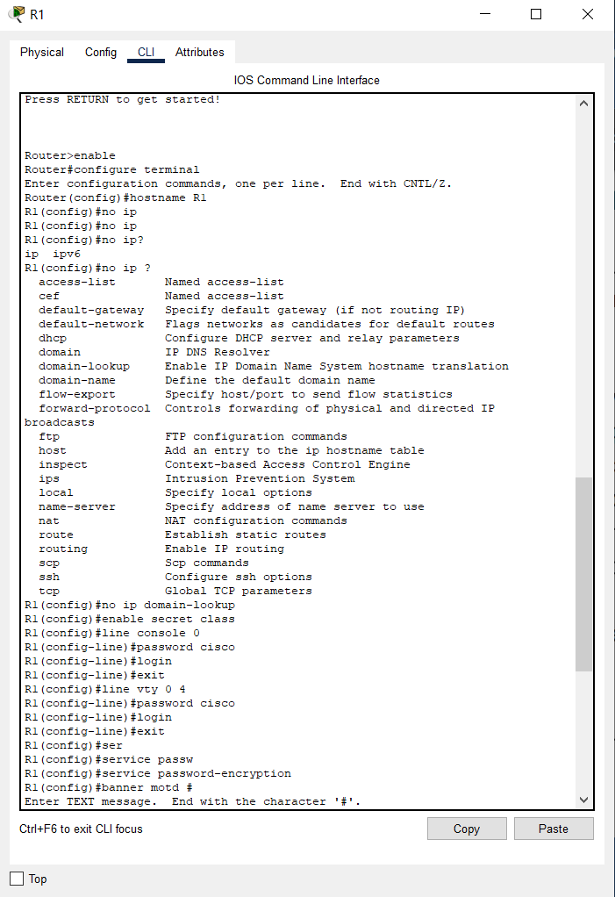
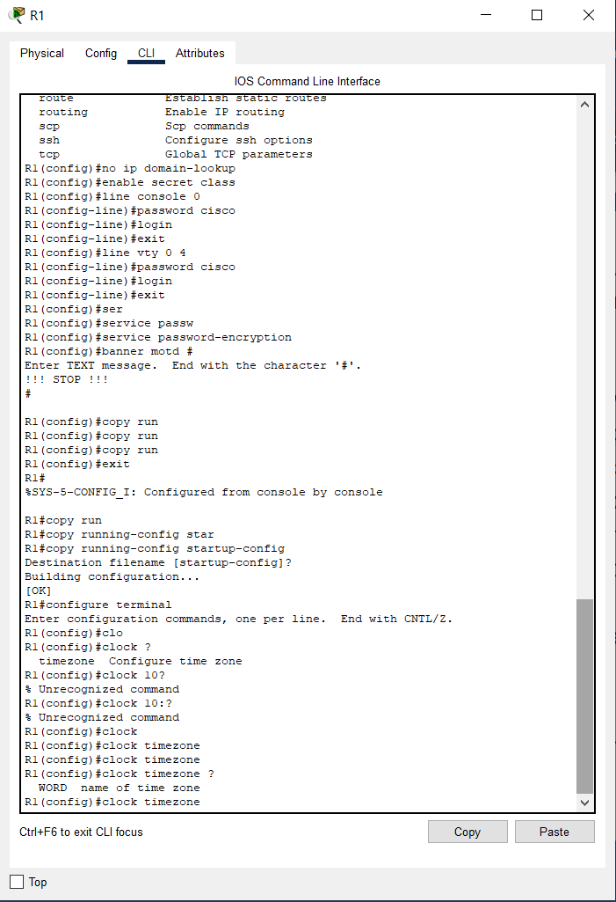
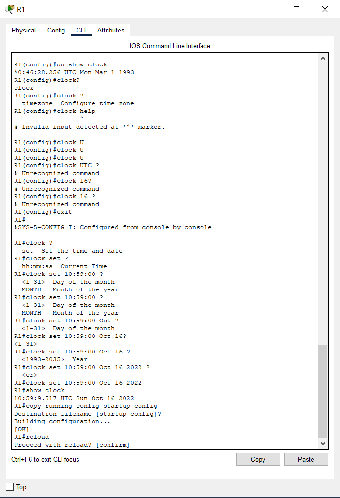
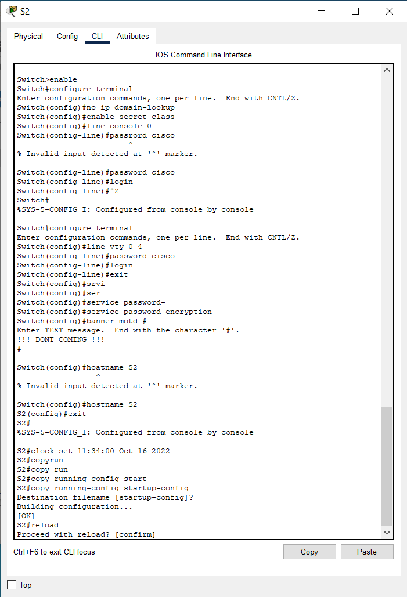
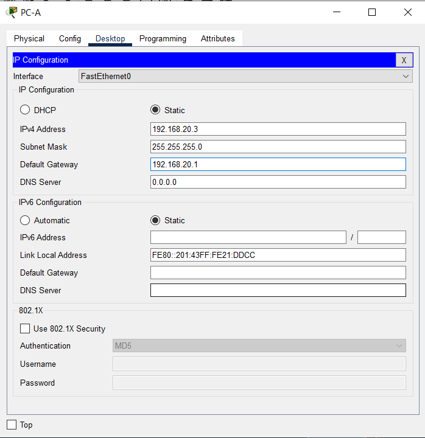
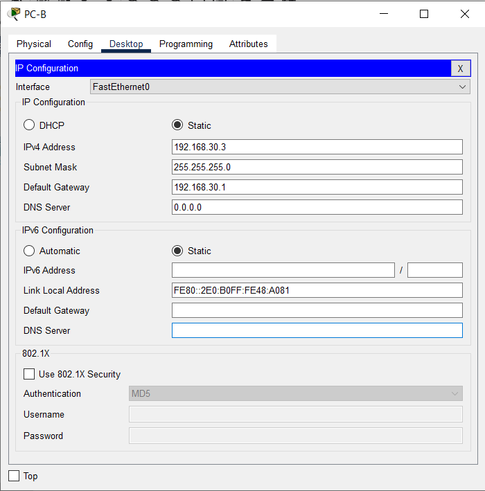
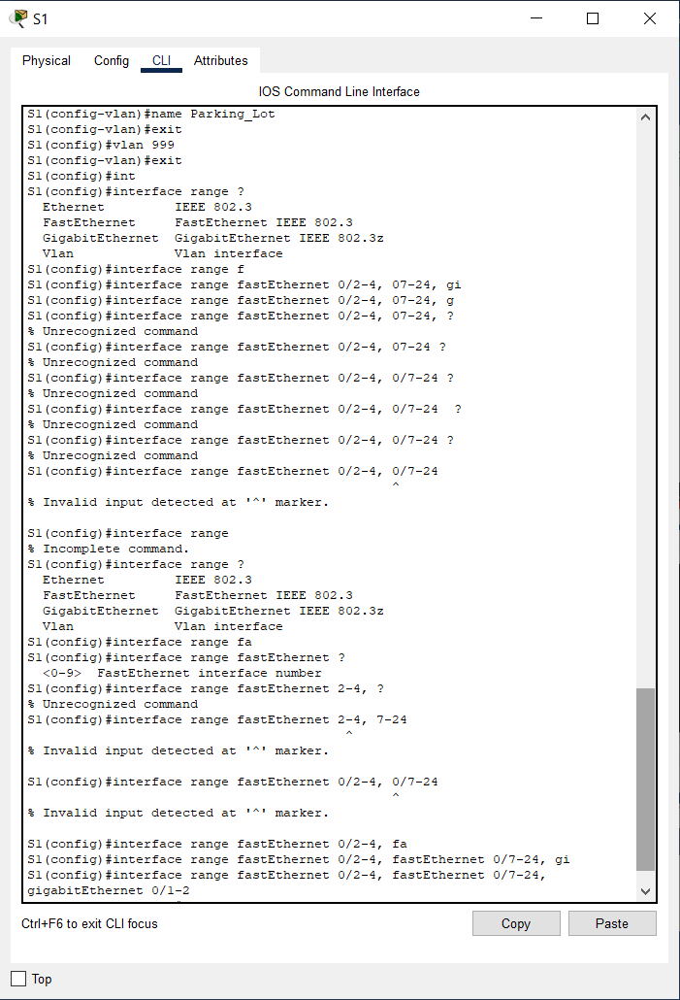
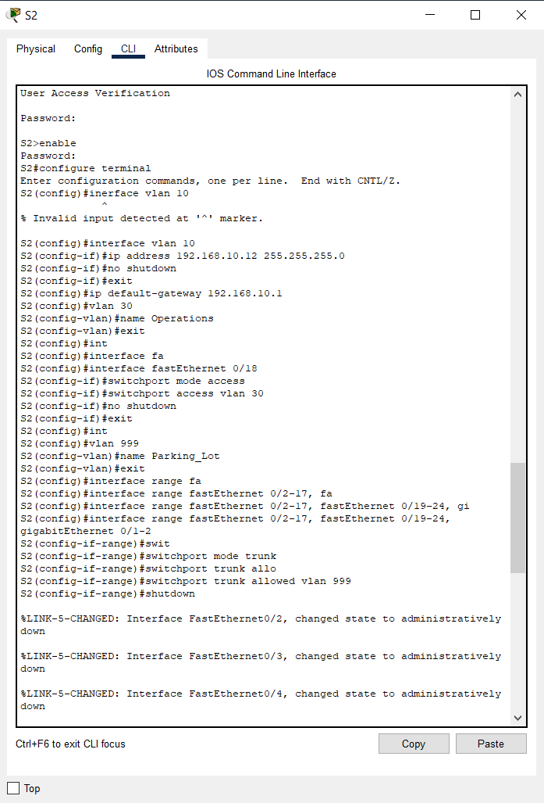

## Лабораторная работа - Внедрение маршрутизации между виртуальными локальными сетями 
#### Топология

#### Таблица адресации
|Устройство|Интерфейс|IP-адрес|Маска подсети|Шлюз по умолчанию|
|:---:|:---:|:---:|:---:|:---:|
|R1|G0/0/1.10|192.168.10.1|255.255.255.0|-|
|  |G0/0/1.20|192.168.20.1|255.255.255.0| |
|  |G0/0/1.30|192.168.30.1|255.255.255.0| |
|  |G0/0/1.1000|-|-| |
|S1|VLAN 10|192.168.10.11|255.255.255.0|192.168.10.1|
|S2|VLAN 10|192.168.10.12|255.255.255.0|192.168.10.1|
|PC-A|NIC|192.168.20.3|255.255.255.0|192.168.20.1|
|PC-B|NIC|192.168.30.3|255.255.255.0|192.168.30.1|  
#### Таблица VLAN
|VLAN|Имя|Назначенный интерфейс|
|:---:|:---:|:---:|
|10|Управление|S1: VLAN 10|
| | |S2: VLAN 20|
|20|Sales|S1: F0/6|
|30|Operations|S2: F0/18|
|999|Parking_Lot|C1: F0/2-4, F0/2-4, F0/7-24, G0/1-2|
| | |C2: F0/2-17, F0/19-24, G0/1-2|
|1000|Собственная|-|
#### Задачи
##### Часть 1. Создание сети и настройка основных параметров устройства
##### Часть 2. Создание сетей VLAN и назначение портов коммутатора
##### Часть 3. Настройка транка 802.1Q между коммутаторами.
##### Часть 4. Настройка маршрутизации между сетями VLAN
##### Часть 5. Проверка, что маршрутизация между VLAN работает
#### Инструкции
### Часть 1. Создание сети и настройка основных параметров устройства
В первой части лабораторной работы вам предстоит создать топологию сети и настроить базовые параметры для узлов ПК и коммутаторов.
#### Шаг 1. Создайте сеть согласно топологии.
Подключите устройства, как показано в топологии, и подсоедините необходимые кабели.
#### Шаг 2. Настройте базовые параметры для маршрутизатора.
a.	Подключитесь к маршрутизатору с помощью консоли и активируйте привилегированный режим EXEC.
Откройте окно конфигурации  
b.	Войдите в режим конфигурации.  
c.	Назначьте маршрутизатору имя устройства.  
d.	Отключите поиск DNS, чтобы предотвратить попытки маршрутизатора неверно преобразовывать введенные команды таким образом, как будто они являются именами узлов.  
e.	Назначьте class в качестве зашифрованного пароля привилегированного режима EXEC.  
f.	Назначьте cisco в качестве пароля консоли и включите вход в систему по паролю.  
g.	Установите cisco в качестве пароля виртуального терминала и активируйте вход.  
h.	Зашифруйте открытые пароли.  
i.	Создайте баннер с предупреждением о запрете несанкционированного доступа к устройству.  
j.	Сохраните текущую конфигурацию в файл загрузочной конфигурации.  
k.	Настройте на маршрутизаторе время.  
Закройте окно настройки.  
**Базовые настройки маршрутизатора [тут](Basic_configure_R1.txt)**  
Скриншоты с настройкой R1 ниже:  
  
  
  
#### Шаг 3. Настройте базовые параметры каждого коммутатора.
a.	Присвойте коммутатору имя устройства.  
b.	Отключите поиск DNS, чтобы предотвратить попытки маршрутизатора неверно преобразовывать введенные команды таким образом, как будто они являются именами узлов.  
c.	Назначьте class в качестве зашифрованного пароля привилегированного режима EXEC.  
d.	Назначьте cisco в качестве пароля консоли и включите вход в систему по паролю.  
e.	Установите cisco в качестве пароля виртуального терминала и активируйте вход.  
f.	Зашифруйте открытые пароли.  
g.	Создайте баннер с предупреждением о запрете несанкционированного доступа к устройству.  
h.	Настройте на коммутаторах время.  
i.	Сохранение текущей конфигурации в качестве начальной.  
Закройте окно настройки.  
**Базовые настройки коммутатора S1 [тут](Basic_configure_S1.txt)**  
**Базовые настройки коммутатора S2 [тут](Basic_configure_S2.txt)**  
Скриншоты с настройкой S1 и S2 ниже:  
  
  
#### Шаг 4. Настройте узлы ПК.
Адреса ПК можно посмотреть в таблице адресации.
  
  
### Часть 2. Создание сетей VLAN и назначение портов коммутатора
Во второй части вы создадите VLAN, как указано в таблице выше, на обоих коммутаторах. Затем вы назначите VLAN соответствующему интерфейсу и проверите настройки конфигурации. Выполните следующие задачи на каждом коммутаторе.
#### Шаг 1. Создайте сети VLAN на коммутаторах.
a.	Создайте и назовите необходимые VLAN на каждом коммутаторе из таблицы выше.  
Откройте окно конфигурации  
b.	Настройте интерфейс управления и шлюз по умолчанию на каждом коммутаторе, используя информацию об IP-адресе в таблице адресации.  
c.	Назначьте все неиспользуемые порты коммутатора VLAN Parking_Lot, настройте их для статического режима доступа и административно деактивируйте их.  
**Примечание.** Команда interface range полезна для выполнения этой задачи с минимальным количеством команд.  
  
  
  
  
#### Шаг 2. Назначьте сети VLAN соответствующим интерфейсам коммутатора.
a.	Назначьте используемые порты соответствующей VLAN (указанной в таблице VLAN выше) и настройте их для режима статического доступа.  
b.	Убедитесь, что VLAN назначены на правильные интерфейсы.  
Закройте окно настройки.  
**~Не совсем понятно, что требуется? VLAN на коммутаторах мы настроили выше~**
### Часть 3. Конфигурация магистрального канала стандарта 802.1Q между коммутаторами
В части 3 вы вручную настроите интерфейс F0/1 как транк.
#### Шаг 1. Вручную настройте магистральный интерфейс F0/1 на коммутаторах S1 и S2.
a.	Настройка статического транкинга на интерфейсе F0/1 для обоих коммутаторов.
Откройте окно конфигурации
b.	Установите native VLAN 1000 на обоих коммутаторах.
c.	Укажите, что VLAN 10, 20, 30 и 1000 могут проходить по транку.
d.	Проверьте транки, native VLAN и разрешенные VLAN через транк.
#### Шаг 2. Вручную настройте магистральный интерфейс F0/5 на коммутаторе S1.
a.	Настройте интерфейс S1 F0/5 с теми же параметрами транка, что и F0/1. Это транк до маршрутизатора.
b.	Сохраните текущую конфигурацию в файл загрузочной конфигурации.
c.	Проверка транкинга.
Вопрос:
Что произойдет, если G0/0/1 на R1 будет отключен?
Закройте окно настройки.
### Часть 4. Настройка маршрутизации между сетями VLAN
#### Шаг 1. Настройте маршрутизатор.
Откройте окно конфигурации
a.	При необходимости активируйте интерфейс G0/0/1 на маршрутизаторе.
b.	Настройте подинтерфейсы для каждой VLAN, как указано в таблице IP-адресации. Все подинтерфейсы используют инкапсуляцию 802.1Q. Убедитесь, что подинтерфейсу для native VLAN не назначен IP-адрес. Включите описание для каждого подинтерфейса.
c.	Убедитесь, что вспомогательные интерфейсы работают
Закройте окно настройки.
### Часть 5. Проверьте, работает ли маршрутизация между VLAN
#### Шаг 1. Выполните следующие тесты с PC-A. Все должно быть успешно.
Примечание. Возможно, вам придется отключить брандмауэр ПК для работы ping
a.	Отправьте эхо-запрос с PC-A на шлюз по умолчанию.
b.	Отправьте эхо-запрос с PC-A на PC-B.
c.	Отправьте команду ping с компьютера PC-A на коммутатор S2.
#### Шаг 2. Пройдите следующий тест с PC-B
В окне командной строки на PC-B выполните команду tracert на адрес PC-A.
Вопрос:
Какие промежуточные IP-адреса отображаются в результатах?
