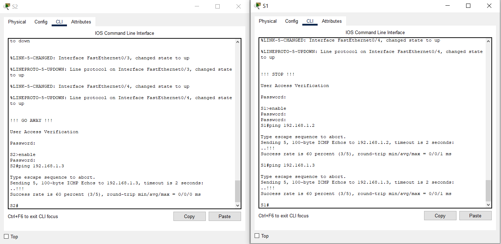
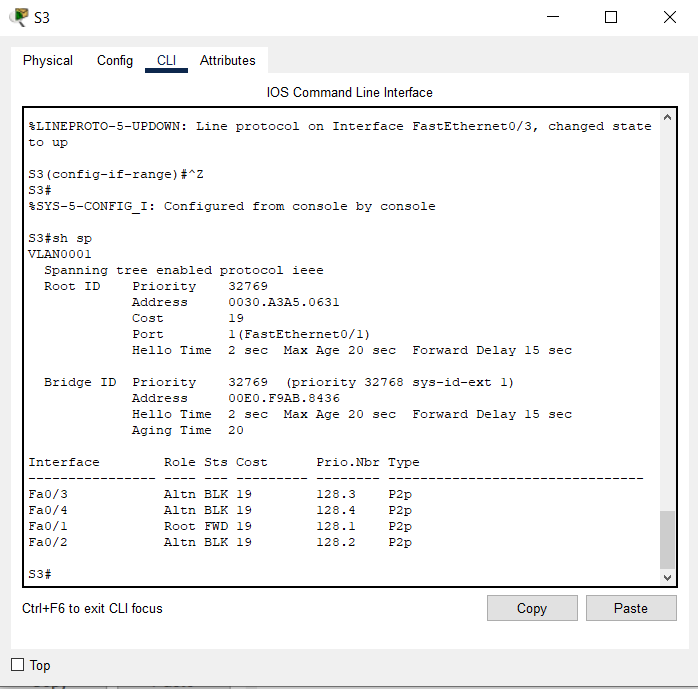

## Развертывание коммутируемой сети с резервными каналами

### Топология
  
### Таблица адресации  
|Устройство|Интерфейс|IP-адрес|Маска подсети|
|:---:|:---:|:---:|:---:|
|S1|VLAN 1|192.168.1.1|255.255.255.0|
|S2|VLAN 1|192.168.1.2|255.255.255.0|
|S3|VLAN 1|192.168.1.3|255.255.255.0|  
### Цели
#### Часть 1. Создание сети и настройка основных параметров устройства
#### Часть 2. Выбор корневого моста
#### Часть 3. Наблюдение за процессом выбора протоколом STP порта, исходя из стоимости портов
#### Часть 4. Наблюдение за процессом выбора протоколом STP порта, исходя из приоритета портов
#### Часть 1:	Создание сети и настройка основных параметров устройства
В части 1 вам предстоит настроить топологию сети и основные параметры маршрутизаторов.
##### Шаг 1: Создайте сеть согласно топологии.
Подключите устройства, как показано в топологии, и подсоедините необходимые кабели.
##### Шаг 2: Выполните инициализацию и перезагрузку коммутаторов.
##### Шаг 3: Настройте базовые параметры каждого коммутатора.
a. Отключите поиск DNS.  
**configure terminal**  
**no ip-domain lookup**  
b. Присвойте имена устройствам в соответствии с топологией.  
**hostname S1**  
c. Назначьте class в качестве зашифрованного пароля доступа к привилегированному режиму.  
**enable secret _class_**  
d. Назначьте cisco в качестве паролей консоли и VTY и активируйте вход для консоли и VTY каналов.  
**line vty 0 4** 
**password _cisco_**  
**login**  
**exit**  
**line console 0**  
**password _cisco_**  
**login**  
**exit**  
e. Настройте logging synchronous для консольного канала.  
**logging synchronous**  
f. Настройте баннерное сообщение дня (MOTD) для предупреждения пользователей о запрете несанкционированного доступа.  
**banner motd #  
!!! STOP !!! #**  
g. Задайте IP-адрес, указанный в таблице адресации для VLAN 1 на всех коммутаторах.  
**interface vlan 1**  
**ip address 192.168.1.1 255.255.255.0**  
**no shutdown**  
**exit**
h. Скопируйте текущую конфигурацию в файл загрузочной конфигурации.  
**copy running-config startup-config**  
**reload**  
Файлы с настройкой коммутаторов расположены [здесь](Configure/)  
#### Шаг 4: Проверьте связь.
Проверьте способность компьютеров обмениваться эхо-запросами.  
  
Успешно ли выполняется эхо-запрос от коммутатора S1 на коммутатор S2?  
**ДА**  
Успешно ли выполняется эхо-запрос от коммутатора S1 на коммутатор S3?  
**ДА**  
Успешно ли выполняется эхо-запрос от коммутатора S2 на коммутатор S3?  
**ДА**  
Выполняйте отладку до тех пор, пока ответы на все вопросы не будут положительными.  
### Часть 2: Определение корневого моста
Для каждого экземпляра протокола spanning-tree (коммутируемая сеть LAN или широковещательный домен) существует коммутатор, выделенный в качестве корневого моста. Корневой мост служит точкой привязки для всех расчётов протокола spanning-tree, позволяя определить избыточные пути, которые следует заблокировать.
Процесс выбора определяет, какой из коммутаторов станет корневым мостом. Коммутатор с наименьшим значением идентификатора моста (BID) становится корневым мостом. Идентификатор BID состоит из значения приоритета моста, расширенного идентификатора системы и MAC-адреса коммутатора. Значение приоритета может находиться в диапазоне от 0 до 65535 с шагом 4096. По умолчанию используется значение 32768.
#### Шаг 1: Отключите все порты на коммутаторах.
#### Шаг 2: Настройте подключенные порты в качестве транковых.  
#### Шаг 3: Включите порты F0/2 и F0/4 на всех коммутаторах.  
  
#### Шаг 4: Отобразите данные протокола spanning-tree.
Введите команду **show spanning-tree** на всех трех коммутаторах. Приоритет идентификатора моста рассчитывается путем сложения значений приоритета и расширенного идентификатора системы. Расширенным идентификатором системы всегда является номер сети VLAN. В примере ниже все три коммутатора имеют равные значения приоритета идентификатора моста (32769 = 32768 + 1, где приоритет по умолчанию = 32768, номер сети VLAN = 1); следовательно, коммутатор с самым низким значением MAC-адреса становится корневым мостом (в примере — S2).  
**S1# show spanning-tree**  
  
**S2# show spanning-tree**  
  
**S3# show spanning-tree**  
  
**Примечание.** Режим STP по умолчанию на коммутаторе 2960 — протокол STP для каждой сети VLAN (PVST).  
В схему ниже запишите роль и состояние (Sts) активных портов на каждом коммутаторе в топологии.  
  
С учетом выходных данных, поступающих с коммутаторов, ответьте на следующие вопросы.  
Какой коммутатор является корневым мостом?  
**S2**  
Почему этот коммутатор был выбран протоколом spanning-tree в качестве корневого моста?  
**У коммутатора S2 наименьшее значение MAC-адреса по отношению к двум другим коммутаторам.**  
Какие порты на коммутаторе являются корневыми портами?  
**На коммутаторе S1 Root-port: F0/2**  
**На коммутаторе S3 Root-port: F0/2**  
**На коммутаторе S2 Root-port: отсутствуют**  
Какие порты на коммутаторе являются назначенными портами?  
**На коммутаторе S1 Designated-port: F0/4**  
**На коммутаторе S2 Designated-port: F0/2, F0/4**  
**На коммутаторе S1 Designated-port: отсутствует**  
Какой порт отображается в качестве альтернативного и в настоящее время заблокирован?  
**На коммутаторе S3 Alternate-port: F0/4, blocked.**  
Почему протокол spanning-tree выбрал этот порт в качестве невыделенного (заблокированного) порта?  
**Так как Root-коммутатор выбирает какой порт заблокировать, то был выбран в качестве альтернативного порта и заблокирован порт F0/4 коммутатора S3.  
Причина такого выбора связана с тем, что MAC-адрес коммутатора S1 меньше, чем у S3.**
### Часть 3: Наблюдение за процессом выбора протоколом STP порта, исходя из стоимости портов.
Алгоритм протокола spanning-tree (STA) использует корневой мост как точку привязки, после чего определяет, какие порты будут заблокированы, исходя из стоимости пути. Порт с более низкой стоимостью пути является предпочтительным. Если стоимости портов равны, процесс сравнивает BID. Если BID равны, для определения корневого моста используются приоритеты портов. Наиболее низкие значения являются предпочтительными. В части 3 вам предстоит изменить стоимость порта, чтобы определить, какой порт будет заблокирован протоколом spanning-tree.  
#### Шаг 1: Определите коммутатор с заблокированным портом.
При текущей конфигурации только один коммутатор может содержать заблокированный протоколом STP порт. Выполните команду **show spanning-tree** на обоих коммутаторах некорневого моста. В примере ниже протокол spanning-tree блокирует порт F0/4 на коммутаторе с самым высоким идентификатором BID ~(S1)~ **В моем случае (S3)**.  
**S1# show spanning-tree**  
  
**S3# show spanning-tree**  
  
**Примечание.** В конкретной топологии корневой мост может отличаться от выбора порта.
#### Шаг 2: Измените стоимость порта.
Помимо заблокированного порта, единственным активным портом на этом коммутаторе является порт, выделенный в качестве порта корневого моста. Уменьшите стоимость этого порта корневого моста до 18, выполнив команду **spanning-tree cost 18** режима конфигурации интерфейса.  
**S1(config)# interface f0/2**  
**S1(config-if)# spanning-tree cost 18**  

**_У меня данные настройки не применились_**  
  
#### Шаг 3: Просмотрите изменения протокола spanning-tree.
Повторно выполните команду **show spanning-tree** на обоих коммутаторах некорневого моста. Обратите внимание, что ранее заблокированный порт (S1 – F0/4) теперь является назначенным портом, и протокол spanning-tree теперь блокирует порт на другом коммутаторе некорневого моста (S3 – F0/4).  
**S1# show spanning-tree**  
**_Настройки не применились. В схеме ничего не изменилось_**  
**S3# show spanning-tree**  
**_Настройки не применились. В схеме ничего не изменилось_**  
Почему протокол spanning-tree заменяет ранее заблокированный порт на назначенный порт и блокирует порт, который был назначенным портом на другом коммутаторе?
**Потому что стоимость пути до него становится меньшей и он становится более приоритетным.**  
#### Шаг 4: Удалите изменения стоимости порта.
a. Выполните команду **no spanning-tree cost 18** режима конфигурации интерфейса, чтобы удалить запись стоимости, созданную ранее.  
**S1(config)# interface f0/2**  
**S1(config-if)# no spanning-tree cost 18**  
  
b. Повторно выполните команду **show spanning-tree**, чтобы подтвердить, что протокол STP сбросил порт на коммутаторе некорневого моста, вернув исходные настройки порта. Протоколу STP требуется примерно 30 секунд, чтобы завершить процесс перевода порта.  

### Часть 4: Наблюдение за процессом выбора протоколом STP порта, исходя из приоритета портов
Если стоимости портов равны, процесс сравнивает BID. Если BID равны, для определения корневого моста используются приоритеты портов. Значение приоритета по умолчанию — 128. STP объединяет приоритет порта с номером порта, чтобы разорвать связи. Наиболее низкие значения являются предпочтительными. В части 4 вам предстоит активировать избыточные пути до каждого из коммутаторов, чтобы просмотреть, каким образом протокол STP выбирает порт с учетом приоритета портов.  
a. Включите порты F0/1 и F0/3 на всех коммутаторах.  
  
b. Подождите 30 секунд, чтобы протокол STP завершил процесс перевода порта, после чего выполните команду **show spanning-tree** на коммутаторах некорневого моста. Обратите внимание, что порт корневого моста переместился на порт с меньшим номером, связанный с коммутатором корневого моста, и заблокировал предыдущий порт корневого моста.  
**S1# show spanning-tree**  
  
**S3# show spanning-tree**  
  
Какой порт выбран протоколом STP в качестве порта корневого моста на каждом коммутаторе некорневого моста?  
**На коммутаторе S1 выбран порт F0/1, на коммутаторе S3 порт F0/1.**  
Почему протокол STP выбрал эти порты в качестве портов корневого моста на этих коммутаторах?  
**Так как стоимости интерфейсов равны, эти порты были выбраны из-за наименьшего номера порта.**  
  
#### Вопросы для повторения
1. Какое значение протокол STP использует первым после выбора корневого моста, чтобы определить выбор порта?  
**Первым будет выбираться самое низкое значение моста-отправителя (Bridge ID)**  
2. Если первое значение на двух портах одинаково, какое следующее значение будет использовать протокол STP при выборе порта?  
**Следующим значением при выборе корневого порта является приоритет порта.**  
3. Если оба значения на двух портах равны, каким будет следующее значение, которое использует протокол STP при выборе порта?  
**Далее сравниваются номера портов и приоритет отдается интерфейсу с наименьшим номером интерфейса Root-коммутатора, к которому подключен интерфейс некорневого коммутатора**  
