## Настройка DHCPv6.
### Топология.
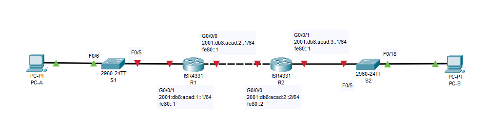  
### Таблица адресации.
|Устройство|Интерфейс|IPv6-адрес|
|:---:|:---:|:---:|
|R1|G0/0/0|2001:db8:acad:2::1/64|
|   |   |fe80::1|
|  |G0/0/1|2001:db8:acad:1::1/64|
|   |   |fe80::1|
|R2|G0/0/0|2001:db8:acad:2::2/64|
|   |   |fe80::2|
|  |G0/0/1|2001:db8:acad:3::1/64|
|   |   |fe80::1|
|PC-A|NIC|DHCP|
|PC-B|NIC|DHCP|    
### Задачи.
#### Часть 1. Создание сети и настройка основных параметров устройства
#### Часть 2. Проверка назначения адреса SLAAC от R1
#### Часть 3. Настройка и проверка сервера DHCPv6 без гражданства на R1
#### Часть 4. Настройка и проверка состояния DHCPv6 сервера на R1
#### Часть 5. Настройка и проверка DHCPv6 Relay на R2
### Инструкции.
#### Часть 1. Создание сети и настройка основных параметров устройства.
В первой части лабораторной работы вам предстоит создать топологию сети и настроить базовые параметры для узлов ПК и коммутаторов.  
##### Шаг 1. Создайте сеть согласно топологии.
Подключите устройства, как показано в топологии, и подсоедините необходимые кабели.  
##### Шаг 2. Настройте базовые параметры каждого коммутатора. (необязательно).
Откройте окно конфигурации  
a.	Присвойте коммутатору имя устройства.  
**enable  
configure terminal  
hostname S1**  
b.	Отключите поиск DNS, чтобы предотвратить попытки маршрутизатора неверно преобразовывать введенные команды таким образом, как будто они являются именами узлов.  
**no ip domain-lookup**  
c.	Назначьте class в качестве зашифрованного пароля привилегированного режима EXEC.  
**enable secret class**  
d.	Назначьте cisco в качестве пароля консоли и включите вход в систему по паролю.  
**line console 0**  
**password cisco**  
**login**  
**logging synchronous**  
**exit**  
e.	Назначьте cisco в качестве пароля VTY и включите вход в систему по паролю.  
**line vty 0 4**  
**password cisco**  
**login**  
**exit**  
f.	Зашифруйте открытые пароли.  
**service password-encryption**  
g.	Создайте баннер с предупреждением о запрете несанкционированного доступа к устройству.  
**banner motd # !!! STOP !!!#**  
h.	Отключите все неиспользуемые порты.  
**interface range fa0/1-4, fa0/7-24, gi0/1-2**  
**shutdown**  
i.	Сохраните текущую конфигурацию в файл загрузочной конфигурации.  
**copy running-config startup-config**  
Закройте окно настройки.  
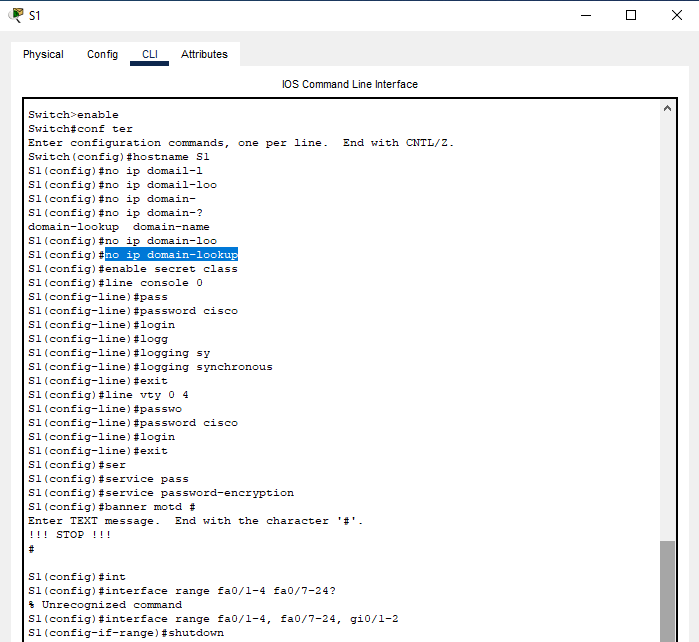  
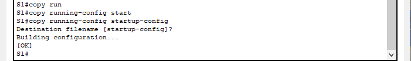  
Базовую настройку всех коммутаторов можно посмотреть [здесь](Configure/).  
##### Шаг 3. Произведите базовую настройку маршрутизаторов.
Откройте окно конфигурации  
a.	Назначьте маршрутизатору имя устройства.  
**enable  
configure terminal  
hostname R1**  
b.	Отключите поиск DNS, чтобы предотвратить попытки маршрутизатора неверно преобразовывать введенные команды таким образом, как будто они являются именами узлов.  
**no ip domain-lookup**  
c.	Назначьте class в качестве зашифрованного пароля привилегированного режима EXEC.  
**enable secret class**  
d.	Назначьте cisco в качестве пароля консоли и включите вход в систему по паролю.  
**line console 0  
password cisco  
login  
logging synchronous  
exit**  
e.	Назначьте cisco в качестве пароля VTY и включите вход в систему по паролю.  
**line vty 0 4  
password cisco  
login  
exit**  
f.	Зашифруйте открытые пароли.  
**service password-encryption**  
g.	Создайте баннер с предупреждением о запрете несанкционированного доступа к устройству.  
**banner motd #!!! WARNING !!!#**  
h.	Активация IPv6-маршрутизации  
**ipv6 unicast-routing**  
**exit**  
i.	Сохраните текущую конфигурацию в файл загрузочной конфигурации.  
**copy running-config startup-config**  
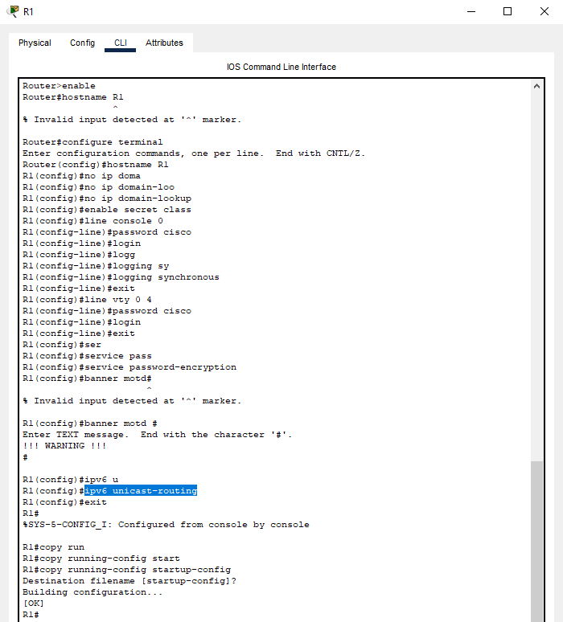  
Базовую настройку всех маршрутизаторов можно посмотреть [здесь](Configure/).  
##### Шаг 4. Настройка интерфейсов и маршрутизации для обоих маршрутизаторов.
a.	Настройте интерфейсы G0/0/0 и G0/1 на R1 и R2 с адресами IPv6, указанными в таблице выше.  
**enable**  
**configure terminal**  
**interface gigabitEthernet 0/0/0**  
**ipv6 address 2001:db8:acad:2::1/64**  
**ipv6 address fe80::1 link-local**  
**no shutdown**  
**exit**  
**interface gigabitEthernet 0/0/1**  
**ipv6 address 2001:db8:acad:1::1/64**  
**ipv6 address fe80::1 link-local**  
**no shutdown**  
**exit**  
b.	Настройте маршрут по умолчанию на каждом маршрутизаторе, который указывает на IP-адрес G0/0/0 на другом маршрутизаторе.  
**ipv6 route ::/0 2001:db8:acad:2::2**  
**exit**  
c.	Убедитесь, что маршрутизация работает с помощью пинга адреса G0/0/1 R2 из R1.  
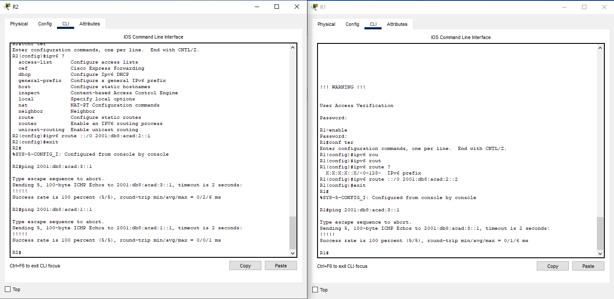  
d.	Сохраните текущую конфигурацию в файл загрузочной конфигурации.  
**copy running-config startup-config**  
Закройте окно настройки.  
Настройки интерфейсов маршрутизаторов можно посмотреть [здесь](Configure/).
#### Часть 2. Проверка назначения адреса SLAAC от R1.
В части 2 вы убедитесь, что узел PC-A получает адрес IPv6 с помощью метода SLAAC.  
Включите PC-A и убедитесь, что сетевой адаптер настроен для автоматической настройки IPv6.  
Через несколько минут результаты команды ipconfig должны показать, что PC-A присвоил себе адрес из сети 2001:db8:_acad_:1::/64.  
**C:\Users\Student> ipconfig**  
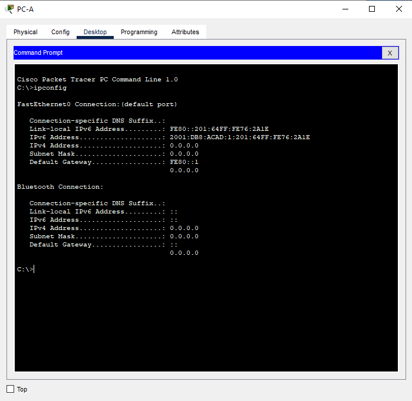  
Откуда взялась часть адреса с идентификатором хоста?  
**Часть адреса с идентификатором хоста сгенерировалась методом SLAAC**  
#### Часть 3. Настройка и проверка сервера DHCPv6 на R1.
В части 3 выполняется настройка и проверка состояния DHCP-сервера на R1. Цель состоит в том, чтобы предоставить PC-A информацию о DNS-сервере и домене.  
##### Шаг 1. Более подробно изучите конфигурацию PC-A.
a.	Выполните команду ipconfig /all на PC-A и посмотрите на результат.  
**C:\Users\Student> ipconfig /all**  
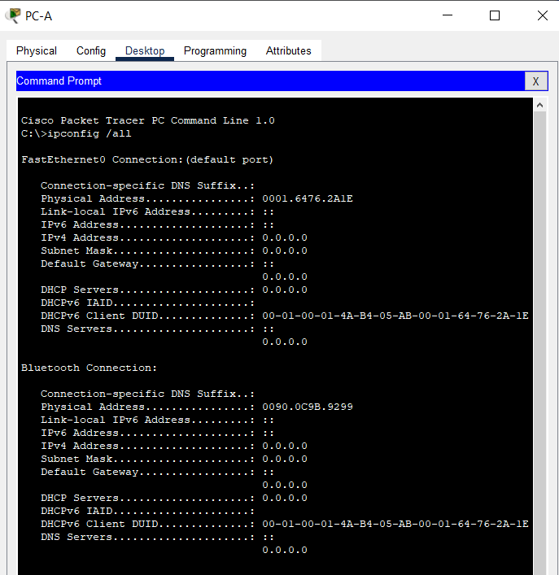  
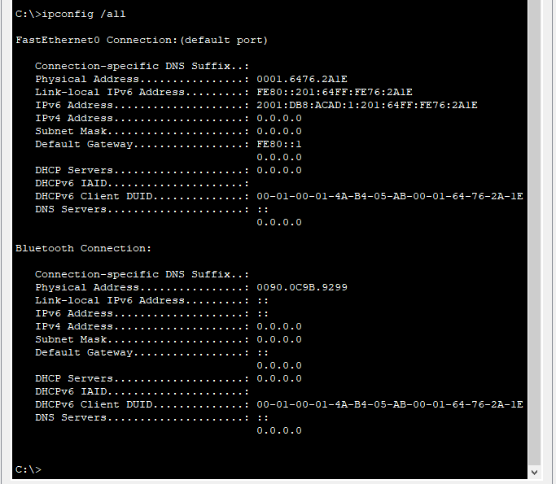  
b.	Обратите внимание, что основной DNS-суффикс отсутствует. Также обратите внимание, что предоставленные адреса DNS-сервера являются адресами «локального сайта anycast», а не одноадресные адреса, как ожидалось.  
##### Шаг 2. Настройте R1 для предоставления DHCPv6 без состояния для PC-A.
a.	Создайте пул DHCP IPv6 на R1 с именем R1-STATELESS. В составе этого пула назначьте адрес DNS-сервера как 2001:db8:acad: :1, а имя домена — как stateless.com.  
Откройте окно конфигурации  
**R1(config)# ipv6 dhcp pool R1-STATELESS**  
**R1(config-dhcp)# dns-server 2001:db8:acad::254**  
**R1(config-dhcp)# domain-name STATELESS.com**  
b.	Настройте интерфейс G0/0/1 на R1, чтобы предоставить флаг конфигурации OTHER для локальной сети R1 и укажите только что созданный пул DHCP в качестве ресурса DHCP для этого интерфейса.  
**R1(config)# interface g0/0/1**  
**R1(config-if)# ipv6 nd other-config-flag**  
**R1(config-if)# ipv6 dhcp server R1-STATELESS**  
c.	Сохраните текущую конфигурацию в файл загрузочной конфигурации.  
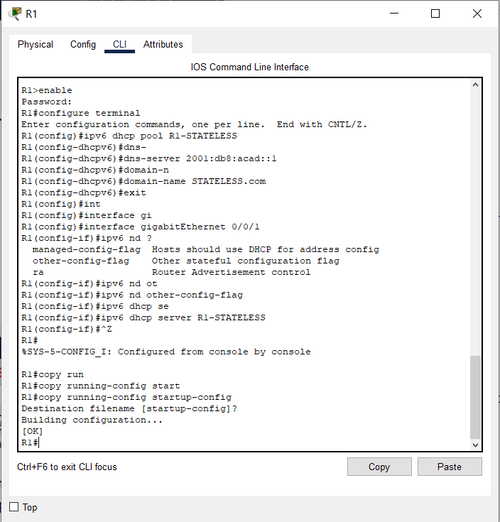  
d.	Перезапустите PC-A.  
e.	Проверьте вывод ipconfig /all и обратите внимание на изменения.  
**C:\Users\Student> ipconfig /all**  
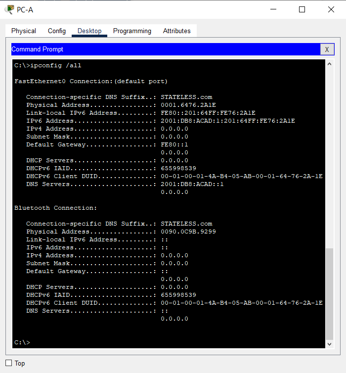  
f.	Тестирование подключения с помощью пинга IP-адреса интерфейса G0/1 R2.  
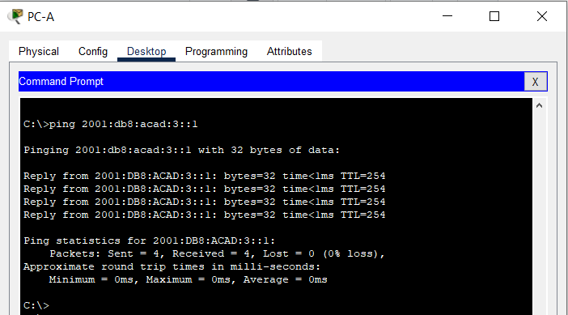  
#### Часть 4. Настройка сервера DHCPv6 с сохранением состояния на R1.
В части 4 настраивается R1 для ответа на запросы DHCPv6 от локальной сети на R2.  
a.	Создайте пул DHCPv6 на R1 для сети 2001:db8:acad:3:aaa::/80. Это предоставит адреса локальной сети, подключенной к интерфейсу G0/0/1 на R2. В составе пула задайте DNS-сервер 2001:db8:acad: :254 и задайте доменное имя STATEFUL.com.  
Откройте окно конфигурации  
**R1(config)# ipv6 dhcp pool R2-STATEFUL**  
**R1(config-dhcp)# address prefix 2001:db8:acad:3:aaa::/80**  
**R1(config-dhcp)# dns-server 2001:db8:acad::254**  
**R1(config-dhcp)# domain-name STATEFUL.com**  
b.	Назначьте только что созданный пул DHCPv6 интерфейсу g0/0/0 на R1.  
**R1(config)# interface g0/0/0**  
**R1(config-if)# ipv6 dhcp server R2-STATEFUL**  
Закройте окно настройки.  
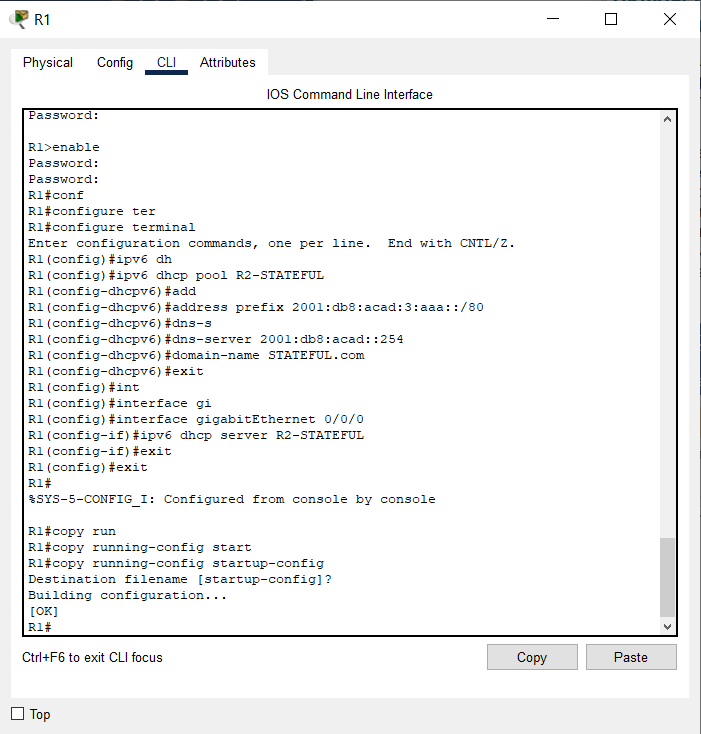  
#### Часть 5. Настройка и проверка ретрансляции DHCPv6 на R2.
В части 5 необходимо настроить и проверить ретрансляцию DHCPv6 на R2, позволяя PC-B получать адрес IPv6.
##### Шаг 1. Включите PC-B и проверьте адрес SLAAC, который он генерирует.
**C:\Users\Student> ipconfig /all**  
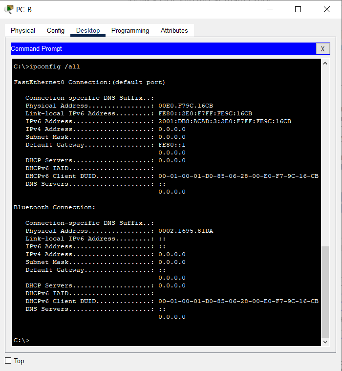  
Обратите внимание на вывод, что используется префикс 2001:db8:acad:3::  
##### Шаг 2. Настройте R2 в качестве агента DHCP-ретрансляции для локальной сети на G0/0/1.
a.	Настройте команду ipv6 dhcp relay на интерфейсе R2 G0/0/1, указав адрес назначения интерфейса G0/0/0 на R1. Также настройте команду managed-config-flag.  
Откройте окно конфигурации  
**R2 (конфигурация) # интерфейс g0/0/1**  
**R2(config-if)# ipv6 nd managed-config-flag**  
**R2(config-if)# ipv6 dhcp relay destination 2001:db8:acad:2::1 g0/0/0**  
b.	Сохраните конфигурацию.  
Закройте окно настройки.  
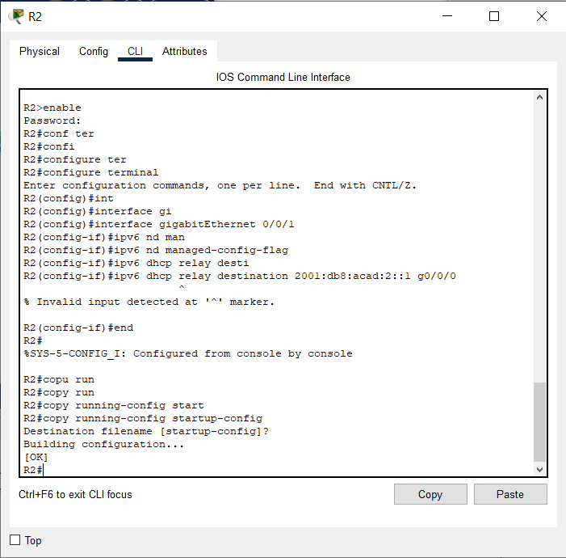  
##### Шаг 3. Попытка получить адрес IPv6 из DHCPv6 на PC-B.
a.	Перезапустите PC-B.  
b.	Откройте командную строку на PC-B и выполните команду ipconfig /all и проверьте выходные данные, чтобы увидеть результаты операции ретрансляции DHCPv6.  
**C:\Users\Student> ipconfig /all**  
**_Ничего не изменилось, команда ретрансляции не применилась_**  
c.	Проверьте подключение с помощью пинга IP-адреса интерфейса R0 G0/0/1.  
**_Пинг не прошел_**  
