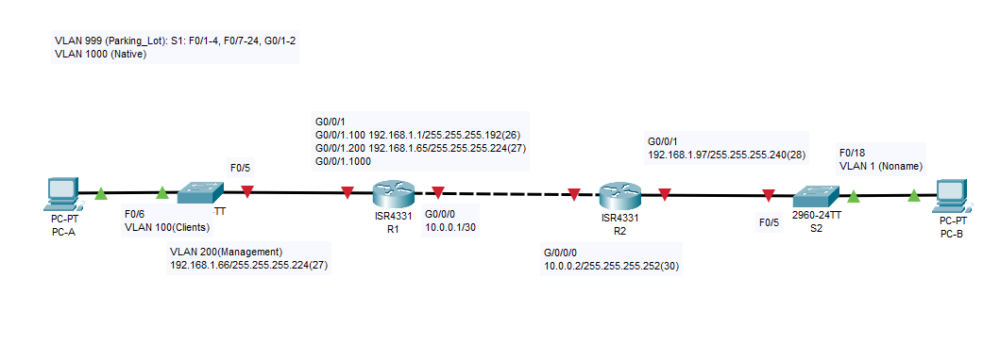

## Реализация DHCPv4.
### Топология.
  
### Таблица адресации.
|Устройство|Интерфейс|IP-адрес|Маска подсети|Шлюз по умолчанию|
|:---:|:---:|:---:|:---:|:---:|
|R1|G0/0/0|10.0.0.1|255.255.255.252|-|
|  |G0/0/1|-|-|-|
|  |G0/0/1.100|192.168.1.1|255.255.255.192| |
|  |G0/0/1.200|192.168.1.65|255.255.255.224| |
|  |G0/0/1.1000|-|-|-|
|R2|G0/0 |10.0.0.2|255.255.255.252|-|
|  |G0/0/1|192.168.1.97|255.255.255.240| |
|S1|VLAN 200|192.168.1.66|255.255.255.224|192.168.1.65|
|S2|VLAN 1|192.168.1.98|255.255.255.240|192.168.1.97|
|PC-A|NIC|DHCP|DHCP|DHCP|
|PC-B|NIC|DHCP|DHCP|DHCP|  
### Таблица VLAN.
|VLAN|Имя|Назначенный интерфейс|
|:---:|:---:|:---:|
|1|Нет|S2: F0/18|
|100|Клиенты|S1: F0/6|
|200|Управление|S1: VLAN 200|
|999|Parking_Lot|S1: F0/1-4, F0/7-24, G0/1-2; S2: F0/1-4, F0/6-17, F0/19-24, G0/1-2|
|1000|Собственная|-|  
### Задачи.
#### Часть 1. Создание сети и настройка основных параметров устройства.
#### Часть 2. Настройка и проверка двух серверов DHCPv4 на R1.
#### Часть 3. Настройка и проверка DHCP-ретрансляции на R2.
### Инструкции.
#### Часть 1.	Создание сети и настройка основных параметров устройства.
В первой части лабораторной работы вам предстоит создать топологию сети и настроить базовые параметры для узлов ПК и коммутаторов.  
##### Шаг 1.	Создание схемы адресации
Подсеть сети 192.168.1.0/24 в соответствии со следующими требованиями:  
a.	Одна подсеть «Подсеть A», поддерживающая 58 хостов (клиентская VLAN на R1).  
Подсеть A:  
Запишите первый IP-адрес в таблице адресации для R1 G0/0/1.100.  
  
b.	Одна подсеть «Подсеть B», поддерживающая 28 хостов (управляющая VLAN на R1).  
Подсеть B:  
Запишите первый IP-адрес в таблице адресации для R1 G0/0/1.200. Запишите второй IP-адрес в таблице адресов для S1 VLAN 200 и введите соответствующий шлюз по умолчанию.  
  
c.	Одна подсеть «Подсеть C», поддерживающая 12 узлов (клиентская сеть на R2).  
Подсеть C:  
Запишите первый IP-адрес в таблице адресации для R2 G0/0/1.  
  
##### Шаг 2.	Создайте сеть согласно топологии.
Подключите устройства, как показано в топологии, и подсоедините необходимые кабели.  
##### Шаг 3.	Произведите базовую настройку маршрутизаторов.
a.	Назначьте маршрутизатору имя устройства.  
enable  
configure terminal  
hostname R1  
b.	Отключите поиск DNS, чтобы предотвратить попытки маршрутизатора неверно преобразовывать введенные команды таким образом, как будто они являются именами узлов.  
no ip domain-lookup  
c.	Назначьте class в качестве зашифрованного пароля привилегированного режима EXEC.  
enable secret class  
d.	Назначьте cisco в качестве пароля консоли и включите вход в систему по паролю.  
line console 0  
password cisco  
login  
logging synchronous  
exit  
e.	Назначьте cisco в качестве пароля VTY и включите вход в систему по паролю.  
line vty 0 4  
password cisco  
login  
exit  
f.	Зашифруйте открытые пароли.  
service password-encryption  
g.	Создайте баннер с предупреждением о запрете несанкционированного доступа к устройству.  
banner motd # !!!STOP!!! #  
exit
h.	Сохраните текущую конфигурацию в файл загрузочной конфигурации.  
copy running-config startup-config  
i.	Установите часы на маршрутизаторе на сегодняшнее время и дату.  
clock set 18:02:00 Nov 01 2022  
Примечание. Вопросительный знак (?) позволяет открыть справку с правильной последовательностью параметров, необходимых для выполнения этой команды.  
##### Шаг 4.	Настройка маршрутизации между сетями VLAN на маршрутизаторе R1
a.	Активируйте интерфейс G0/0/1 на маршрутизаторе.  
b.	Настройте подинтерфейсы для каждой VLAN в соответствии с требованиями таблицы IP-адресации. Все субинтерфейсы используют инкапсуляцию 802.1Q и назначаются первый полезный адрес из вычисленного пула IP-адресов. Убедитесь, что подинтерфейсу для native VLAN не назначен IP-адрес. Включите описание для каждого подинтерфейса.  
c.	Убедитесь, что вспомогательные интерфейсы работают.  
Настройка маршрутизатора R1 приведена [здесь](Configs/IP_R1.txt)  
##### Шаг 5.	Настройте G0/1 на R2, затем G0/0/0 и статическую маршрутизацию для обоих маршрутизаторов
a.	Настройте G0/0/1 на R2 с первым IP-адресом подсети C, рассчитанным ранее.  
b.	Настройте интерфейс G0/0/0 для каждого маршрутизатора на основе приведенной выше таблицы IP-адресации.  
c.	Настройте маршрут по умолчанию на каждом маршрутизаторе, указываемом на IP-адрес G0/0/0 на другом маршрутизаторе.  
d.	Убедитесь, что статическая маршрутизация работает с помощью пинга до адреса G0/0/1 R2 от R1.  
e.	Сохраните текущую конфигурацию в файл загрузочной конфигурации.  
Настройка маршрутизатора R2 приведена [здесь](Configs/IP_R2.txt)  
##### Шаг 6.	Настройте базовые параметры каждого коммутатора.
a.	Присвойте коммутатору имя устройства.  
Откройте окно конфигурации  
enable  
configure terminal  
hostname S1  
b.	Отключите поиск DNS, чтобы предотвратить попытки маршрутизатора неверно преобразовывать введенные команды таким образом, как будто они являются именами узлов.  
no ip domain-lookup  
c.	Назначьте class в качестве зашифрованного пароля привилегированного режима EXEC.  
enable secret class  
d.	Назначьте cisco в качестве пароля консоли и включите вход в систему по паролю.  
line console 0  
password cisco  
login  
logging synchronous  
exit  
e.	Назначьте cisco в качестве пароля VTY и включите вход в систему по паролю.  
line vty 0 4  
password cisco  
login  
exit  
f.	Зашифруйте открытые пароли.  
service password-encryption  
g.	Создайте баннер с предупреждением о запрете несанкционированного доступа к устройству.  
banner motd # !!!GO AWAY!!! #  
exit  
h.	Сохраните текущую конфигурацию в файл загрузочной конфигурации.  
copy running-config startup-config  
i.	Установите часы на маршрутизаторе на сегодняшнее время и дату.  
clock set 00:00:00 Nov 01 2022  
Базовая настройка коммутаторов S1 приведена [здесь](Configs/Basic_S1.txt) и S2 приведена [здесь](Configs/Basic_S2.txt).  
**Примечание. Вопросительный знак (?) позволяет открыть справку с правильной последовательностью параметров, необходимых для выполнения этой команды.**  
j.	Скопируйте текущую конфигурацию в файл загрузочной конфигурации.  
##### Шаг 7.	Создайте сети VLAN на коммутаторе S1.
Примечание. S2 настроен только с базовыми настройками.  
a.	Создайте необходимые VLAN на коммутаторе 1 и присвойте им имена из приведенной выше таблицы.  
b.	Настройте и активируйте интерфейс управления на S1 (VLAN 200), используя второй IP-адрес из подсети, рассчитанный ранее. Кроме того установите шлюз по умолчанию на S1.  
c.	Настройте и активируйте интерфейс управления на S2 (VLAN 1), используя второй IP-адрес из подсети, рассчитанный ранее. Кроме того, установите шлюз по умолчанию на S2.  
d.	Назначьте все неиспользуемые порты S1 VLAN Parking_Lot, настройте их для статического режима доступа и административно деактивируйте их. На S2 административно деактивируйте все неиспользуемые порты.  
Примечание. Команда interface range полезна для выполнения этой задачи с минимальным количеством команд.  
Закройте окно настройки.  
Настройка приведена [здесь](Configs/VLAN_S1.txt).  
##### Шаг 8.	Назначьте сети VLAN соответствующим интерфейсам коммутатора.
a.	Назначьте используемые порты соответствующей VLAN (указанной в таблице VLAN выше) и настройте их для режима статического доступа.  
Откройте окно конфигурации  
b.	Убедитесь, что VLAN назначены на правильные интерфейсы.  
Вопрос:  
Почему интерфейс F0/5 указан в VLAN 1?  
##### Шаг 9.	Вручную настройте интерфейс S1 F0/5 в качестве транка 802.1Q.
a.	Измените режим порта коммутатора, чтобы принудительно создать магистральный канал.  
b.	В рамках конфигурации транка  установите для native  VLAN значение 1000.  
c.	В качестве другой части конфигурации магистрали укажите, что VLAN 100, 200 и 1000 могут проходить по транку.  
d.	Сохраните текущую конфигурацию в файл загрузочной конфигурации.  
e.	Проверьте состояние транка.  
  
Вопрос:  
Какой IP-адрес был бы у ПК, если бы он был подключен к сети с помощью DHCP?  
Закройте окно настройки.  
#### Часть 2.	Настройка и проверка двух серверов DHCPv4 на R1
В части 2 необходимо настроить и проверить сервер DHCPv4 на R1. Сервер DHCPv4 будет обслуживать две подсети, подсеть A и подсеть C.  
##### Шаг 1.	Настройте R1 с пулами DHCPv4 для двух поддерживаемых подсетей. Ниже приведен только пул DHCP для подсети A
a.	Исключите первые пять используемых адресов из каждого пула адресов.  
Откройте окно конфигурации  
b.	Создайте пул DHCP (используйте уникальное имя для каждого пула).  
c.	Укажите сеть, поддерживающую этот DHCP-сервер.  
d.	В качестве имени домена укажите CCNA-lab.com.  
e.	Настройте соответствующий шлюз по умолчанию для каждого пула DHCP.  
f.	Настройте время аренды на 2 дня 12 часов и 30 минут.(_команда не применяется в CPT_)  
g.	Затем настройте второй пул DHCPv4, используя имя пула R2_Client_LAN и вычислите сеть, маршрутизатор по умолчанию, и используйте то же имя домена и время аренды, что и предыдущий пул DHCP.  
##### Шаг 2.	Сохраните конфигурацию.
Сохраните текущую конфигурацию в файл загрузочной конфигурации.  
Закройте окно настройки.  
##### Шаг 3.	Проверка конфигурации сервера DHCPv4
a.	Чтобы просмотреть сведения о пуле, выполните команду show ip dhcp pool .  
b.	Выполните команду show ip dhcp bindings для проверки установленных назначений адресов DHCP.  
c.	Выполните команду show ip dhcp server statistics для проверки сообщений DHCP.  
##### Шаг 4.	Попытка получить IP-адрес от DHCP на PC-A
a.	Из командной строки компьютера PC-A выполните команду ipconfig /all.  
b.	После завершения процесса обновления выполните команду ipconfig для просмотра новой информации об IP-адресе.  
c.	Проверьте подключение с помощью пинга IP-адреса интерфейса R0 G0/0/1.  
#### Часть 3.	Настройка и проверка DHCP-ретрансляции на R2
В части 3 настраивается R2 для ретрансляции DHCP-запросов из локальной сети на интерфейсе G0/0/1 на DHCP-сервер (R1).  
##### Шаг 1.	Настройка R2 в качестве агента DHCP-ретрансляции для локальной сети на G0/0/1
a.	Настройте команду ip helper-address на G0/0/1, указав IP-адрес G0/0/0 R1.  
b.	Сохраните конфигурацию.  
##### Шаг 2.	Попытка получить IP-адрес от DHCP на PC-B
a.	Из командной строки компьютера PC-B выполните команду ipconfig /all.  
b.	После завершения процесса обновления выполните команду ipconfig для просмотра новой информации об IP-адресе.  
c.	Проверьте подключение с помощью пинга IP-адреса интерфейса R1 G0/0/1.  
d.	Выполните show ip dhcp binding для R1 для проверки назначений адресов в DHCP.  
e.	Выполните команду show ip dhcp server statistics для проверки сообщений DHCP.  
