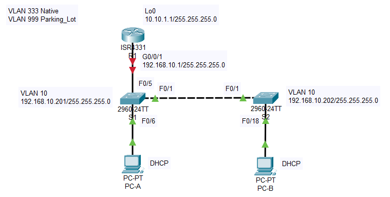
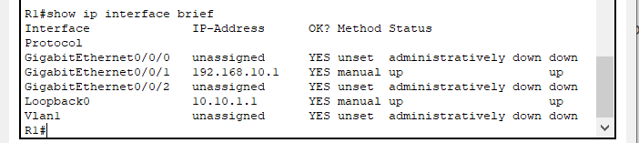
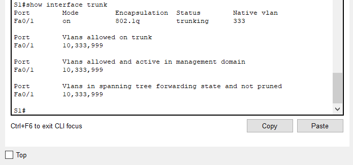
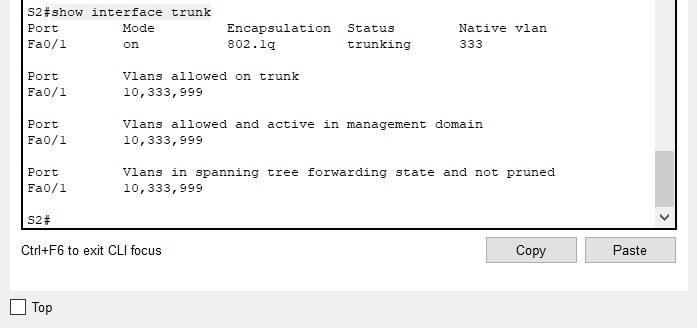
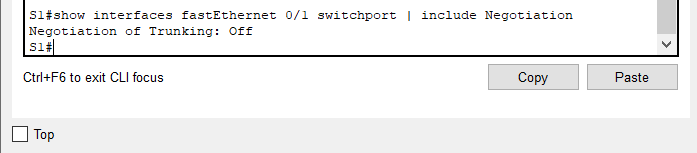
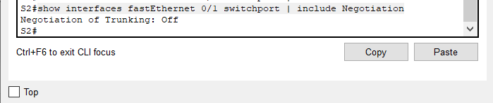
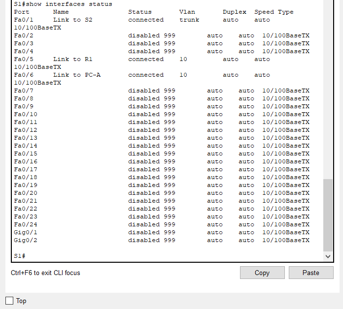
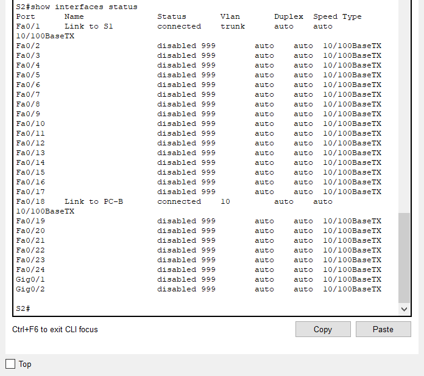
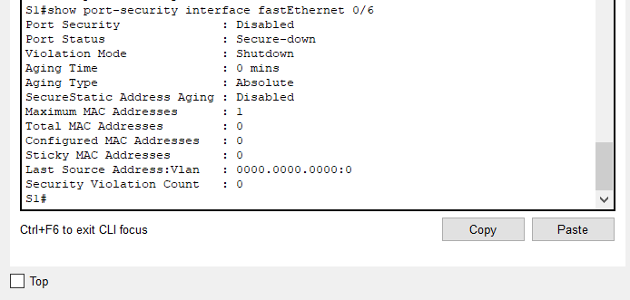
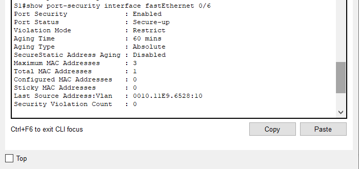

## Конфигурация безопасности коммутатора
### Топология
  
### Таблица адресации
|Устройство|Interface/VLAN|IP-адрес|Маска подсети|
|:---:|:---:|:---:|:---:|
|R1|G0/0/1|192.168.10.1|255.255.255.0|
|  |Loopback 0|10.10.1.1|255.255.255.0|
|S1|VLAN 10|192.168.10.201|255.255.255.0|
|S2|VLAN 10|192.168.10.202|255.255.255.0|
|PC-A|NIC|DHCP|255.255.255.0|
|PC-B|NIC|DHCP|255.255.255.0|
### Цели
#### Часть 1. Настройка основного сетевого устройства
#### Часть 2. Настройка сетей VLAN
#### Часть 3: Настройки безопасности коммутатора.
### Инструкции
#### Часть 1. Настройка основного сетевого устройства
##### Шаг 1. Создайте сеть.
a.	Создайте сеть согласно топологии.  
b.	Инициализация устройств.  
##### Шаг 2. Настройте маршрутизатор R1.
a.	Загрузите следующий конфигурационный скрипт на R1.  
Откройте окно конфигурации  
_enable  
configure terminal  
hostname R1  
no ip domain lookup  
ip dhcp excluded-address 192.168.10.1 192.168.10.9  
ip dhcp excluded-address 192.168.10.201 192.168.10.202  
!  
ip dhcp pool Students  
 network 192.168.10.0 255.255.255.0  
 default-router 192.168.10.1  
 domain-name CCNA2.Lab-11.6.1  
!  
interface Loopback0  
 ip address 10.10.1.1 255.255.255.0  
!  
interface GigabitEthernet0/0/1  
description Link to S1  
**ip dhcp relay information trusted**  ???  
ip address 192.168.10.1 255.255.255.0  
no shutdown  
!  
line con 0  
logging synchronous  
exec-timeout 0 0_  
b.	Проверьте текущую конфигурацию на R1, используя следующую команду:  
_R1# show ip interface brief_  
c.	Убедитесь, что IP-адресация и интерфейсы находятся в состоянии up / up (при необходимости устраните неполадки).  
  
Закройте окно настройки.  
##### Шаг 3. Настройка и проверка основных параметров коммутатора  
a.	Настройте имя хоста для коммутаторов S1 и S2.  
_enable  
configure terminal  
hostname S1_  
Откройте окно конфигурации  
b.	Запретите нежелательный поиск в DNS.  
_no ip domain-lookup_  
c.	Настройте описания интерфейса для портов, которые используются в S1 и S2.  
_interface fastEthernet 0/6  
description Link to PC-A  
exit  
interface fastEthernet 0/1  
description Link to S2  
exit  
interface fastEthernet 0/5  
description Link to R1  
exit_  
d.	Установите для шлюза по умолчанию для VLAN управления значение 192.168.10.1 на обоих коммутаторах.  
_ip default-gateway 192.168.10.1_  
#### Часть 2. Настройка сетей VLAN на коммутаторах.
##### Шаг 1. Сконфигруриуйте VLAN 10.
Добавьте VLAN 10 на S1 и S2 и назовите VLAN - Management.  
enable  
configure terminal  
vlan 10
name Management
exit
##### Шаг 2. Сконфигруриуйте SVI для VLAN 10.
Настройте IP-адрес в соответствии с таблицей адресации для SVI для VLAN 10 на S1 и S2. Включите интерфейсы SVI и предоставьте описание для интерфейса.  
interface vlan10
ip address 192.168.10.201 255.255.255.0
no shutdown
description SVI S1
exit
##### Шаг 3. Настройте VLAN 333 с именем Native на S1 и S2.
enable  
configure terminal  
vlan 333  
name Native  
exit  
##### Шаг 4. Настройте VLAN 999 с именем ParkingLot на S1 и S2.
enable  
configure terminal  
vlan 999  
name Parking_Lot  
exit  
#### Часть 3. Настройки безопасности коммутатора.
##### Шаг 1. Релизация магистральных соединений 802.1Q.
a.	Настройте все магистральные порты Fa0/1 на обоих коммутаторах для использования VLAN 333 в качестве native VLAN.  
enable  
configure terminal  
interface fastEthernet 0/1  
switchport mode trunk  
switchport trunk allowed vlan 333,10,999  
switchport trunk native vlan 333  
end  
b.	Убедитесь, что режим транкинга успешно настроен на всех коммутаторах.  
_S1# show interface trunk  
S2# show interface trunk_  
  
  
c.	Отключить согласование DTP F0/1 на S1 и S2.  
configure terminal  
interface fastEthernet 0/1  
switchport nonegotiate 
d.	Проверьте с помощью команды show interfaces.  
_S1# show interfaces f0/1 switchport | include Negotiation  
S2# show interfaces f0/1 switchport | include Negotiation_  

  
  
##### Шаг 2. Настройка портов доступа
a.	На S1 настройте F0/5 и F0/6 в качестве портов доступа и свяжите их с VLAN 10.  
enable  
configure terminal  
interface range fastEthernet 0/5-6  
switchport mode access  
switchport access vlan 10  
no shutdown  
exit  
b.	На S2 настройте порт доступа Fa0/18 и свяжите его с VLAN 10.  
enable  
configure terminal  
interface fastEthernet 0/18  
switchport mode access  
switchport access vlan 10  
no shutdown  
exit  
##### Шаг 3. Безопасность неиспользуемых портов коммутатора
a.	На S1 и S2 переместите неиспользуемые порты из VLAN 1 в VLAN 999 и отключите неиспользуемые порты.  
На коммутаторе S1:  
interface range fastEthernet 0/2-4, fastEthernet 0/7-24, gigabitEthernet 0/1-2  
switchport mode access  
switchport access vlan 999  
shutdown  
exit  
На коммутаторе S2:  
interface range fastEthernet 0/2-17, fastEthernet 0/19-24, gigabitEthernet 0/1-2  
switchport mode access  
switchport access vlan 999  
shutdown  
exit  
b.	Убедитесь, что неиспользуемые порты отключены и связаны с VLAN 999, введя команду  show.  
_S1# show interfaces status  
S2# show interfaces status_  
  
  
##### Шаг 4. Документирование и реализация функций безопасности порта.
Интерфейсы F0/6 на S1 и F0/18 на S2 настроены как порты доступа. На этом шаге вы также настроите безопасность портов на этих двух портах доступа.  
a.	На S1, введите команду show port-security interface f0/6  для отображения настроек по умолчанию безопасности порта для интерфейса F0/6. Запишите свои ответы ниже.  
  
**Конфигурация безопасности порта по умолчанию**  
|Функция|Настройка по умолчанию|
|---|:---:|
|Защита портов|Disabled|
|Максимальное количество записей MAC-адресов|0|
|Режим проверки на нарушение безопасности|Shutdown|
|Aging Time|0 mins|
|Aging Type|Absolute|
|Secure Static Address Aging|Disabled|
|Sticky MAC Address|0|  

b.	На S1 включите защиту порта на F0/6 со следующими настройками:  
_enable  
configure terminal  
interface fastEthernet 0/6  
switchport mode access  
switchport port-security_  
-Максимальное количество записей MAC-адресов: 3  
_switchport port-security maximum 3_  
-Режим безопасности: restrict  
_switchport port-security violation restrict_  
-Aging time: 60 мин.  
_switchport port-security aging time 60_  
-Aging type: неактивный  
_switchport port-security aging type inactivity_ **(в CPT команда не работает)**  
c.	Verify port security on S1 F0/6.  
_S1# show port-security interface f0/6_  
  
_S1# show port-security address_  
  
d.	Включите безопасность порта для F0/18 на S2. Настройте каждый активный порт доступа таким образом, чтобы он автоматически добавлял адреса МАС, изученные на этом порту, в текущую конфигурацию.  
e.	Настройте следующие параметры безопасности порта на S2 F/18:  
-Максимальное количество записей MAC-адресов: 2  
-Тип безопасности: Protect  
-Aging time: 60 мин.  
f.	Проверка функции безопасности портов на S2 F0/18.  
_S2# show port-security interface f0/18  
S2# show port-security address_  
##### Шаг 5. Реализовать безопасность DHCP snooping.
a.	На S2 включите DHCP snooping и настройте DHCP snooping во VLAN 10.  
b.	Настройте магистральные порты на S2 как доверенные порты.  
c.	Ограничьте ненадежный порт Fa0/18 на S2 пятью DHCP-пакетами в секунду.  
d.	Проверка DHCP Snooping на S2.  
_S2# show ip dhcp snooping_  
e.	В командной строке на PC-B освободите, а затем обновите IP-адрес.  
_C:\Users\Student> ipconfig /release  
C:\Users\Student> ipconfig /renew_  
f.	Проверьте привязку отслеживания DHCP с помощью команды show ip dhcp snooping binding.  
_S2# show ip dhcp snooping binding_  
##### Шаг 6. Реализация PortFast и BPDU Guard
a.	Настройте PortFast на всех портах доступа, которые используются на обоих коммутаторах.  
b.	Включите защиту BPDU на портах доступа VLAN 10 S1 и S2, подключенных к PC-A и PC-B.  
c.	Убедитесь, что защита BPDU и PortFast включены на соответствующих портах.  
_S1# show spanning-tree interface f0/6 detail_  
##### Шаг 7. Проверьте наличие сквозного подключения.
Проверьте PING свзяь между всеми устройствами в таблице IP-адресации. В случае сбоя проверки связи может потребоваться отключить брандмауэр на хостах.  
Закройте окно настройки.  
Вопросы для повторения  
1.	С точки зрения безопасности порта на S2, почему нет значения таймера для оставшегося возраста в минутах, когда было сконфигурировано динамическое обучение-sticky?   2.	Что касается безопасности порта на S2, если вы загружаете скрипт текущей конфигурации на S2, почему порту 18 на PC-B никогда не получит IP-адрес через DHCP?  
3.	Что касается безопасности порта, в чем разница между типом абсолютного устаревания и типом устаревание по неактивности?  
