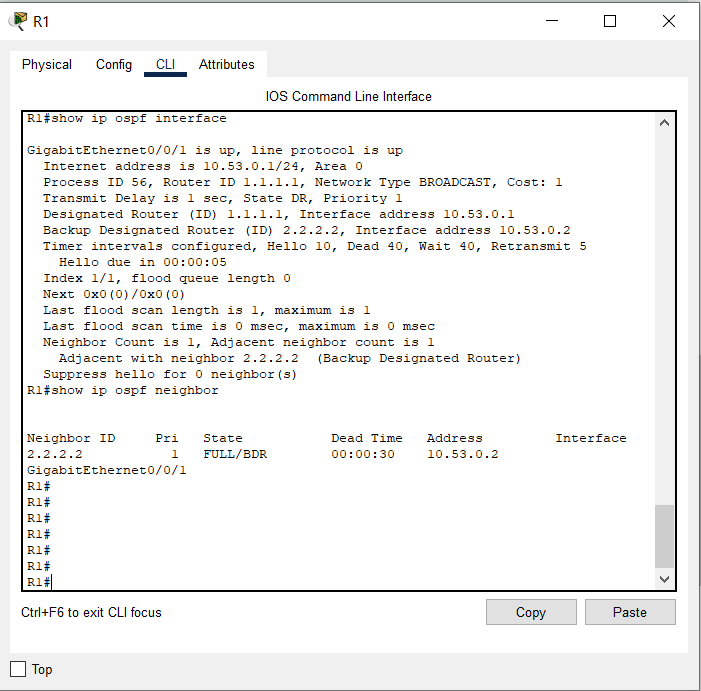
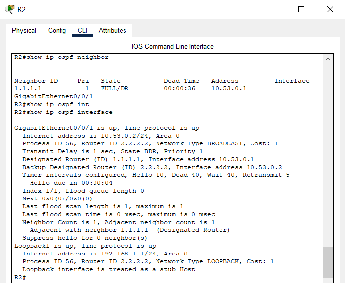
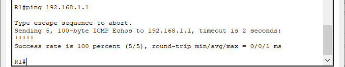

## Настройка протокола OSPFv2 для одной области
### Топология
### Таблица адресации
|Устройство|Интерфейс|IP-адрес|Маска подсети|
|:---:|:---:|:---:|:---:|
|R1|G0/0/1|10.53.0.1|255.255.255.0|
|  |Loopback 1|172.16.1.1|255.255.255.0|
|R2|G0/0/1|10.53.0.2|255.255.255.0|
|  |Loopback 1|192.168.1.1|255.255.255.0|  
### Цели
#### Часть 1. Создание сети и настройка основных параметров устройства
#### Часть 2. Настройка и проверка базовой работы протокола  OSPFv2 для одной области
#### Часть 3. Оптимизация и проверка конфигурации OSPFv2 для одной области
### Инструкции
#### Часть 1. Создание сети и настройка основных параметров устройства
##### Шаг 1. Создайте сеть согласно топологии.
Подключите устройства, как показано в топологии, и подсоедините необходимые кабели.  
##### Шаг 2. Произведите базовую настройку маршрутизаторов.
Откройте окно конфигурации  
a.	Назначьте маршрутизатору имя устройства.  
b.	Отключите поиск DNS, чтобы предотвратить попытки маршрутизатора неверно преобразовывать введенные команды таким образом, как будто они являются именами узлов.  
c.	Назначьте class в качестве зашифрованного пароля привилегированного режима EXEC.  
d.	Назначьте cisco в качестве пароля консоли и включите вход в систему по паролю.  
e.	Назначьте cisco в качестве пароля VTY и включите вход в систему по паролю.  
f.	Зашифруйте открытые пароли.  
g.	Создайте баннер с предупреждением о запрете несанкционированного доступа к устройству.  
h.	Сохраните текущую конфигурацию в файл загрузочной конфигурации.  
_Базовая настройка маршрутизаторов приведена [здесь](Configs/)_  
##### Шаг 3. Настройте базовые параметры каждого коммутатора.
a.	Назначьте коммутатору имя устройства.  
b.	Отключите поиск DNS, чтобы предотвратить попытки маршрутизатора неверно преобразовывать введенные команды таким образом, как будто они являются именами узлов.  
c.	Назначьте class в качестве зашифрованного пароля привилегированного режима EXEC.  
d.	Назначьте cisco в качестве пароля консоли и включите вход в систему по паролю.  
e.	Назначьте cisco в качестве пароля VTY и включите вход в систему по паролю.  
f.	Зашифруйте открытые пароли.  
g.	Создайте баннер с предупреждением о запрете несанкционированного доступа к устройству.  
h.	Сохраните текущую конфигурацию в файл загрузочной конфигурации.  
_Базовая настройка коммутаторов приведена [здесь](Configs/)_  
#### Часть 2. Настройка и проверка базовой работы протокола OSPFv2 для одной области
##### Шаг 1. Настройте адреса интерфейса и базового OSPFv2 на каждом маршрутизаторе.
a.	Настройте адреса интерфейсов на каждом маршрутизаторе, как показано в таблице адресации выше.  
_Настройки интерфейсов [R1](Configs/Interface_R1) и [R2](Configs/Interface_R2) описаны по ссылкам._  
Откройте окно конфигурации  
b.	Перейдите в режим конфигурации маршрутизатора OSPF, используя идентификатор процесса 56.  
**Для R1:**  
_R1>enable  
R1#configure terminal  
R1(config)#router ospf 56_  
**Для R2:**  
_R2>enable  
R2#configure terminal  
R2(config)#router ospf 56_  
c.	Настройте статический идентификатор маршрутизатора для каждого маршрутизатора (1.1.1.1 для R1, 2.2.2.2 для R2).  
**Для R1:**  
_R1(config-router)#router-id 1.1.1.1  
R1(config-router)#exit_  
**Для R2:**  
_R2(config-router)#router-id 2.2.2.2  
R2(config-router)#exit_  
d.	Настройте инструкцию сети для сети между R1 и R2, поместив ее в область 0.  
**Для R1:**  
_R1(config)#interface gigabitEthernet 0/0/1  
R1(config-if)#ip ospf 56 area 0  
R1(config-if)#exit_  
**Для R2:**  
_R2(config)#interface gigabitEthernet 0/0/1  
R2(config-if)#ip ospf 56 area 0  
R2(config-if)#exit_  
e.	Только на R2 добавьте конфигурацию, необходимую для объявления сети Loopback 1 в область OSPF 0.  
**Для R2:**  
_R2(config)#interface loopback 1  
R2(config-if)#ip ospf 56 area 0  
R2(config-if)#exit_  
f.	Убедитесь, что OSPFv2 работает между маршрутизаторами. Выполните команду, чтобы убедиться, что R1 и R2 сформировали смежность.  
  
  
**Вопрос:
Какой маршрутизатор является DR? Какой маршрутизатор является BDR? Каковы критерии отбора?**  
**_DR является маршрутизатор R1, BDR является маршрутизатор R2. R1 выбран DR из-за того, что у него старше router-id (1.1.1.1), который мы назначили вручную._**???  
g.	На R1 выполните команду show ip route ospf, чтобы убедиться, что сеть R2 Loopback1 присутствует в таблице маршрутизации. Обратите внимание, что поведение OSPF по умолчанию заключается в объявлении интерфейса обратной связи в качестве маршрута узла с использованием 32-битной маски.  
  
h.	Запустите Ping до  адреса интерфейса R2 Loopback 1 из R1. Выполнение команды ping должно быть успешным.  
  
Закройте окно настройки.  
#### Часть 3. Оптимизация и проверка конфигурации OSPFv2 для одной области
##### Шаг 1. Реализация различных оптимизаций на каждом маршрутизаторе.
Откройте окно конфигурации  
a.	На R1 настройте приоритет OSPF интерфейса G0/0/1 на 50, чтобы убедиться, что R1 является назначенным маршрутизатором.  
b.	Настройте таймеры OSPF на G0/0/1 каждого маршрутизатора для таймера приветствия, составляющего 30 секунд.  
c.	На R1 настройте статический маршрут по умолчанию, который использует интерфейс Loopback 1 в качестве интерфейса выхода. Затем распространите маршрут по умолчанию в OSPF. Обратите внимание на сообщение консоли после установки маршрута по умолчанию.  
d.	добавьте конфигурацию, необходимую для OSPF для обработки R2 Loopback 1 как сети точка-точка. Это приводит к тому, что OSPF объявляет Loopback 1 использует маску подсети интерфейса.  
e.	Только на R2 добавьте конфигурацию, необходимую для предотвращения отправки объявлений OSPF в сеть Loopback 1.  
f.	Измените базовую пропускную способность для маршрутизаторов. После этой настройки перезапустите OSPF с помощью команды clear ip ospf process . Обратите внимание на сообщение консоли после установки новой опорной полосы пропускания.  
##### Шаг 2. Убедитесь, что оптимизация OSPFv2 реализовалась.
a.	Выполните команду show ip ospf interface g0/0/1 на R1 и убедитесь, что приоритет интерфейса установлен равным 50, а временные интервалы — Hello 30, Dead 120, а тип сети по умолчанию — Broadcast.  
b.	На R1 выполните команду show ip route ospf, чтобы убедиться, что сеть R2 Loopback1 присутствует в таблице маршрутизации. Обратите внимание на разницу в метрике между этим выходным и предыдущим выходным. Также обратите внимание, что маска теперь составляет 24 бита, в отличие от 32 битов, ранее объявленных.  
c.	Введите команду show ip route ospf на маршрутизаторе R2. Единственная информация о маршруте OSPF должна быть распространяемый по умолчанию маршрут R1.  
d.	Запустите Ping до адреса интерфейса R1 Loopback 1 из R2. Выполнение команды ping должно быть успешным.  
**Вопрос:
Почему стоимость OSPF для маршрута по умолчанию отличается от стоимости OSPF в R1 для сети 192.168.1.0/24?**
