## Лабораторная работа - Настройка протоколов CDP, LLDP и NTP.
### Топология
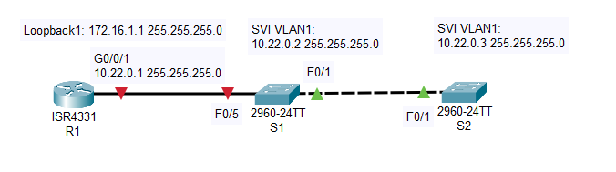  
### Таблица адресации
|Устройство|Интерфейс|IP-адрес|Маска подсети|Шлюз по умолчанию|
|:---:|:---:|:---:|:---:|:---:|
|R1|Loopback1|172.16.1.1|255.255.255.0|-|
||G0/0/1|10.22.0.1|255.255.255.0|-|
|S1|SVI VLAN 1|10.22.0.2|255.255.255.0|10.22.0.1|
|S2|SVI VLAN 2|10.22.0.3|255.255.255.0|10.22.0.1|  
### Задачи
#### Часть 1. Создание сети и настройка основных параметров устройства
#### Часть 2. Обнаружение сетевых ресурсов с помощью протокола CDP
#### Часть 3. Обнаружение сетевых ресурсов с помощью протокола LLDP
#### Часть 4. Настройка и проверка NTP
#### Часть 1. Создание сети и настройка основных параметров устройства
В первой части лабораторной работы вам предстоит создать топологию сети и настроить основные параметры для маршрутизатора и коммутаторов.  
##### Шаг 1. Создайте сеть согласно топологии.
Подключите устройства, как показано в топологии, и подсоедините необходимые кабели.  
##### Шаг 2. Настройте базовые параметры для маршрутизатора.
Откройте окно конфигурации  
a.Назначьте маршрутизатору имя устройства.  
b.Отключите поиск DNS, чтобы предотвратить попытки маршрутизатора неверно преобразовывать введенные команды таким образом, как будто они являются именами узлов.  
c.Назначьте class в качестве зашифрованного пароля привилегированного режима EXEC.  
d.Назначьте cisco в качестве пароля консоли и включите вход в систему по паролю.  
e.Назначьте cisco в качестве пароля VTY и включите вход в систему по паролю.  
f.Зашифруйте открытые пароли.  
g.Создайте баннер с предупреждением о запрете несанкционированного доступа к устройству.  
h.Настройка интерфейсов, перечисленных в таблице выше  
i.Сохраните текущую конфигурацию в файл загрузочной конфигурации.  
Закройте окно настройки.  
Настройка маршрутизатора [R1](Configs/R1).  
##### Шаг 3. Настройте базовые параметры каждого коммутатора.
Откройте окно конфигурации  
a.Присвойте коммутатору имя устройства.  
b.Отключите поиск DNS, чтобы предотвратить попытки маршрутизатора неверно преобразовывать введенные команды таким образом, как будто они являются именами узлов.  
c.Назначьте class в качестве зашифрованного пароля привилегированного режима EXEC.  
d.Назначьте cisco в качестве пароля консоли и включите вход в систему по паролю.  
e.Назначьте cisco в качестве пароля VTY и включите вход в систему по паролю.  
f.Зашифруйте открытые пароли.  
g.Создайте баннер, который предупреждает всех, кто обращается к устройству, видит баннерное сообщение «Только авторизованные пользователи!».  
h.Отключите неиспользуемые интерфейсы  
i.Сохраните текущую конфигурацию в файл загрузочной конфигурации.  
Закройте окно настройки.  
Базовые настройки коммутаторов [S1](Configs/S1.txt) и [S2](Configs/S2.txt).  
#### Часть 2. Обнаружение сетевых ресурсов с помощью протокола CDP
На устройствах Cisco протокол CDP включен по умолчанию. Воспользуйтесь CDP, чтобы обнаружить порты, к которым подключены кабели.  
Откройте окно конфигурации  
a.На R1 используйте соответствующую команду show cdp, чтобы определить, сколько интерфейсов включено CDP, сколько из них включено и сколько отключено.  
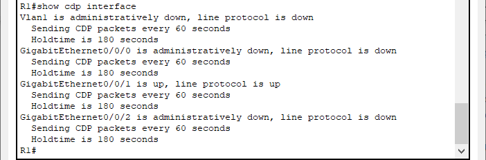   
Вопрос:  
Сколько интерфейсов участвует в объявлениях CDP? Какие из них активны?  
Введите ваш ответ здесь.  
**Учавствует 4 интерфейса: Vlan1, GigabitEthernet0/0/0, GigabitEthernet0/0/1, GigabitEthernet0/0/2. Активен интерфейс GigabitEthernet0/0/1.**  
b.На R1 используйте соответствующую команду show cdp, чтобы определить версию IOS, используемую на S1.  
R1#show cdp entry S1  
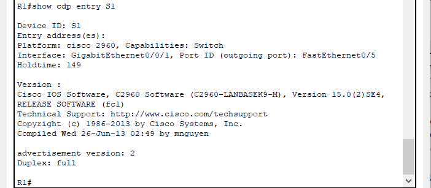  
Вопрос:  
Какая версия IOS используется на S1?  
Введите ваш ответ здесь.  
**Используется версия IOS:  
Version :
Cisco IOS Software, C2960 Software (C2960-LANBASEK9-M), Version 15.0(2)SE4**  

c.На S1 используйте соответствующую команду show cdp, чтобы определить, сколько пакетов CDP было выданных.  
S1# show cdp traffic  
**_Данная команда не поддерживается в СРТ_**  
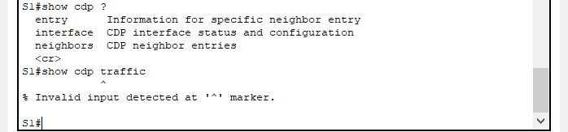  
CDP counters :   
        Total packets output: 179, Input: 148   
        Hdr syntax: 0, Chksum error: 0, Encaps failed: 0   
        No memory: 0, Invalid packet: 0,   
        CDP version 1 advertisements output: 0, Input: 0   
        CDP version 2 advertisements output: 179, Input: 148  
Вопрос:  
Сколько пакетов имеет выход CDP с момента последнего сброса счетчика?  
Введите ваш ответ здесь.  
**_Данная команда не поддерживается в СРТ_**   
d.Настройте SVI для VLAN 1 на S1 и S2, используя IP-адреса, указанные в таблице адресации выше. Настройте шлюз по умолчанию для каждого коммутатора на основе таблицы адресов.  
Настройки SVI для VLAN 1 для [S1](Configs/SVI_VLAN1_S1.txt) и [S2](Configs/SVI_VLAN1_S2.txt).  
e.На R1 выполните команду **show cdp entry S1**.  
Вопрос:  
Какие дополнительные сведения доступны теперь?  
Введите ваш ответ здесь.  
**Теперь в выводимой информации появился ip-адрес интерфейса SVI VLAN 1 коммутатора S1 (_но у меня не появилось строчки про Native VLAN1_)**  
R1 # show cdp entry  S1   
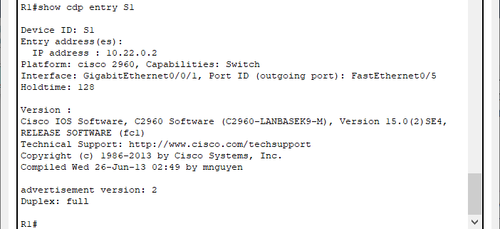  
f.Отключить CDP глобально на всех устройствах.  
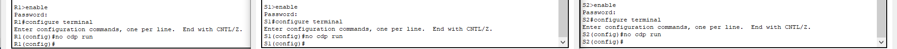   
Закройте окно настройки.  
#### Часть 3. Обнаружение сетевых ресурсов с помощью протокола LLDP
На устройствах Cisco протокол LLDP может быть включен по умолчанию. Воспользуйтесь LLDP, чтобы обнаружить порты, к которым подключены кабели.  
Откройте окно конфигурации  
a.Введите соответствующую команду lldp, чтобы включить LLDP на всех устройствах в топологии.  
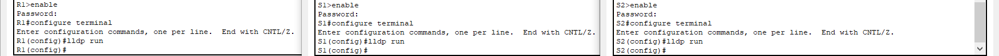  
b.На S1 выполните соответствующую команду lldp, чтобы предоставить подробную информацию о S2.  
S1# show lldp entry S2  
**Данная команда отсутствует в СРТ**  
  
**Но получилось посмотреть подробную информацию о соседях следующей командой:**  
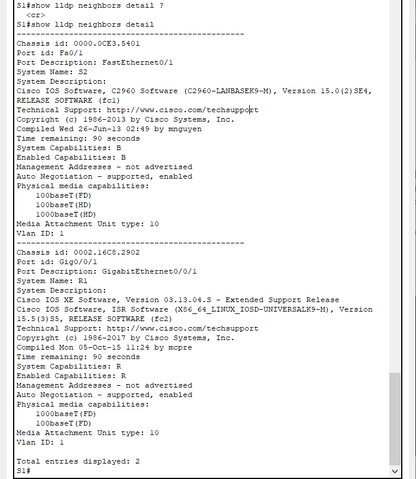  

Вопрос:  
Что такое chassis ID  для коммутатора S2?  
Введите ваш ответ здесь.  
**chassis ID  для коммутатора S2-это МАС-адрес интерфейса FastEthernet0/1, которым он подключен к S1**  
Закройте окно настройки.  
c.Соединитесь через консоль на всех устройствах и используйте команды LLDP, необходимые для отображения топологии физической сети только из выходных данных команды show.  
**_Не совсем понял, что необходимо сделать в данном пункте_**  
#### Часть 4. Настройка NTP
В части 4 необходимо настроить маршрутизатор R1 в качестве сервера NTP, а маршрутизатор R2 в качестве клиента NTP маршрутизатора R1. Необходимо выполнить синхронизацию времени для Syslog и отладочных функций. Если время не синхронизировано, сложно определить, какое сетевое событие стало причиной данного сообщения.  
##### Шаг 1. Выведите на экран текущее время.
Откройте окно конфигурации  
Введите команду show clock **_detail_** для отображения текущего времени на R1. Запишите отображаемые сведения о текущем времени в следующей таблице.  
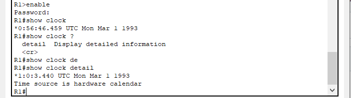  

|Дата|Время|Часовой пояс|Источник времени|
|:---:|:---:|:---:|:---:|
|Mon Mar 1 1993|или *0:56:46.459 или *1:0:3.440|UTC|hardware calendar|  
##### Шаг 2. Установите время.
С помощью команды clock set установите время на маршрутизаторе R1. Введенное время должно быть в формате UTC.  
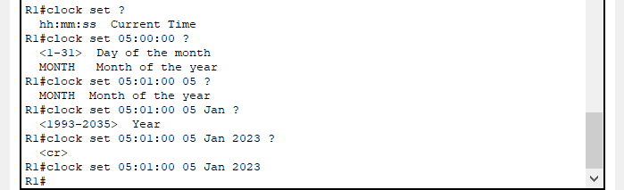  
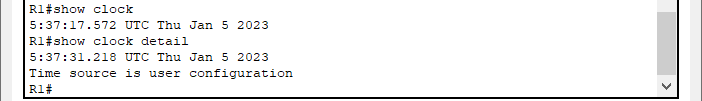  
##### Шаг 3. Настройте главный сервер NTP.
Настройте R1 в качестве хозяина NTP с уровнем слоя 4.  
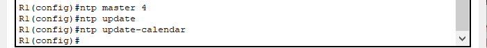  
##### Шаг 4. Настройте клиент NTP.
a.Выполните соответствующую команду на S1 и S2, чтобы просмотреть настроенное время. Запишите текущее время,  в следующей таблице.  
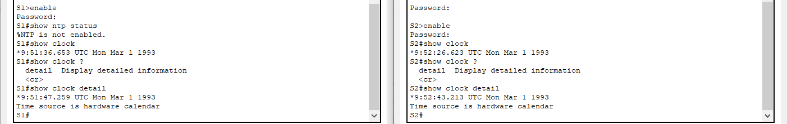  
|Устройсво|Дата|Время|Часовой пояс|
|:---:|:---:|:---:|:---:|
|S1|Mon Mar 1 1993|*9:51:47.259|UTC|
|S2|Mon Mar 1 1993|*9:52:43.213|UTC|  

b.Настройте S1 и S2 в качестве клиентов NTP. Используйте соответствующие команды NTP для получения времени от интерфейса G0/0/1 R1, а также для периодического обновления календаря или аппаратных часов коммутатора.  
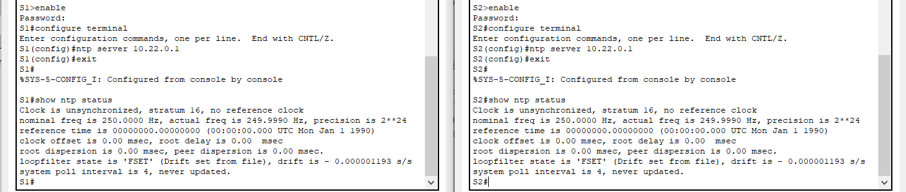  

##### Шаг 5. Проверьте настройку NTP.  
a.Используйте соответствующую команду show , чтобы убедиться, что S1 и S2 синхронизированы с R1.  
Примечание. Синхронизация метки времени на маршрутизаторе R2 с меткой времени на маршрутизаторе R1 может занять несколько минут.  
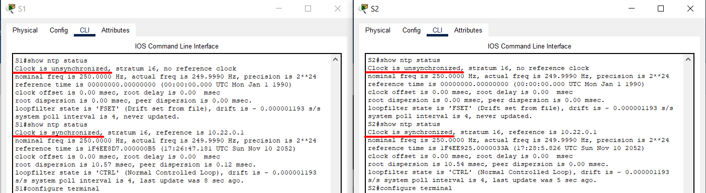  
b.Выполните соответствующую команду на S1 и S2, чтобы просмотреть настроенное время и сравнить ранее записанное время.  

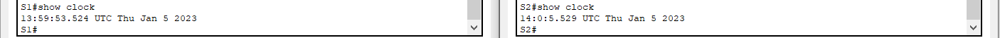  

Вопрос для повторения  
Для каких интерфейсов в пределах сети не следует использовать протоколы обнаружения сетевых ресурсов? Поясните ответ.  
